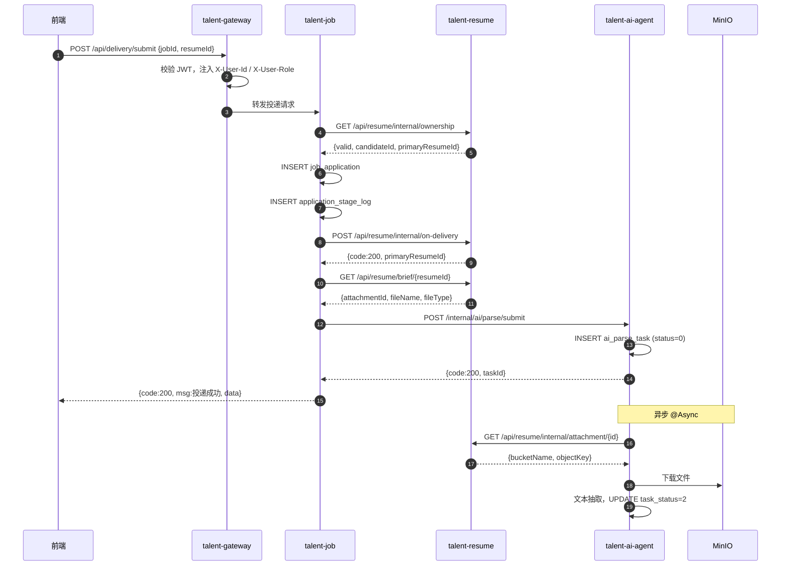

# TalentAI — API 接入流程指南

> **适用对象**：前端开发、后端微服务开发  
> **网关入口**：`http://localhost:8080`（`talent-gateway`）  
> **设计依据**：`精简.md`、`talent-ai-backend`、`talent-ai-front`  
> **版本**：v1.0（MVP Sprint 1）

---

## 1. 总体架构

所有外部请求统一经过 **API 网关**（`talent-gateway:8080`），由网关完成 JWT 校验后，将用户信息写入请求头，再路由到各微服务。

```
┌─────────────┐     Bearer Token      ┌──────────────────┐
│ talent-ai-  │ ────────────────────► │ talent-gateway   │
│ front       │     /api/**           │ :8080            │
└─────────────┘                       └────────┬─────────┘
                                               │ lb:// 路由
                    ┌──────────────────────────┼──────────────────────────┐
                    ▼                          ▼                          ▼
            talent-auth              talent-job /              talent-resume
            /api/auth/**             talent-resume             /api/resume/**
                                     /api/job/**
                                     /api/delivery/**
                                               │
                                               ▼
                                       talent-ai-agent
                                       /api/ai/**（对外）
                                       /internal/ai/**（服务间）
```

### 1.1 网关路由表

| 路径前缀 | 目标服务 | 说明 |
|----------|----------|------|
| `/api/auth/**` | `talent-auth` | 登录、注册、账号管理 |
| `/api/job/**` | `talent-job` | HR 岗位 CRUD |
| `/api/delivery/**` | `talent-job` | 候选人投递 |
| `/api/resume/**` | `talent-resume` | 简历上传、在线简历、HR 简历管理 |
| `/api/ai/**` | `talent-ai-agent` | AI 解析/匹配查询（HR 端） |
| `/internal/ai/**` | `talent-ai-agent` | **微服务内部** AI 触发（Feign） |

### 1.2 鉴权与白名单

- **前端请求**：Header 携带 `Authorization: Bearer <JWT_TOKEN>`
- **网关校验通过后**：自动向下游注入
  - `X-User-Id`：当前用户 ID
  - `X-User-Role`：角色（如 `CANDIDATE`、`HR`、`ADMIN`）
- **白名单**（无需 Token）：`/api/auth/login`、`/api/auth/register`、`/internal/ai/**`

---

## 2. 统一响应格式

### 2.1 标准包装（`talent-common` 的 `R<T>`）

多数对外接口返回：

```json
{
  "code": 200,
  "msg": "操作成功",
  "data": { }
}
```

| code | 含义 |
|------|------|
| 200 | 成功 |
| 401 | 未登录或 Token 过期 |
| 403 | 无权限 |
| 400 / 404 / 409 / 500 | 业务或系统错误 |

### 2.2 特殊格式

部分早期接口（如 `talent-auth` 登录、`talent-job` 投递）直接在根级返回字段，例如：

```json
{
  "code": 200,
  "msg": "投递成功",
  "data": { "id": 1, "applicationNo": "APP20260608123456", ... }
}
```

登录接口额外在根级返回 `token`、`userInfo`（无 `data` 字段）。

### 2.3 内部接口（Feign）

`/internal/ai/**` 及 `/api/resume/internal/**` 使用 `Map<String, Object>`，约定：

```json
{ "code": 200, "msg": "ok", "data": { ... } }
```

失败时：`{ "code": 400, "msg": "错误原因" }`

---

## 3. 前端接入规范

### 3.1 请求封装

前端统一使用 `talent-ai-front/src/utils/request.js`：

- `baseURL`：开发环境走 Vite 代理至网关 `8080`
- 请求拦截：自动从 `localStorage.talent_token` 注入 `Authorization`
- 响应拦截：`code !== 200` 时 reject；有 `data` 则返回 `data`，否则返回整包

### 3.2 新增 API 的三步流程

**Step 1 — 在 `src/api/` 新建或扩展模块**

```typescript
// src/api/delivery.ts
import request from '@/utils/request'

export interface DeliverySubmitPayload {
  jobId: number
  resumeId: number
  channel?: number
}

export function submitApplication(payload: DeliverySubmitPayload) {
  return request.post('/api/delivery/submit', payload)
}
```

**Step 2 — 在页面中调用**

```typescript
import { submitApplication } from '@/api/delivery'

const result = await submitApplication({ jobId: 1, resumeId: 2 })
// result 已是拦截器解包后的 data
```

**Step 3 — 配置 Vite 代理（开发环境）**

确保 `/api` 代理到 `http://localhost:8080`（网关）。

### 3.3 前端已对接 vs 待对接

| 模块 | 状态 | API 文件 |
|------|------|----------|
| 登录 / 注册 | ✅ 已对接 | `api/auth.ts` |
| 候选人岗位 / 投递 | ✅ 已对接 | `api/job.ts`、`api/delivery.ts` |
| 候选人档案 / 简历 | ✅ 已对接 | `api/candidateProfile.ts`、`api/resume.ts`、`api/onlineResume.ts` |
| HR 岗位 / 简历 | ✅ 已对接 | `api/hrJob.ts`、`api/hrResume.ts`、`api/hrCandidate.ts` |
| 管理员账号 | ✅ 已对接 | `api/adminAccount.ts` |
| AI 解析 / 匹配查询 | ❌ 待对接 | 需新建 `api/ai.ts` |
| HR 工作台 / 面试 / Offer / 人才库 | ❌ Mock 数据 | 待后端服务就绪后对接 |

---

## 4. 后端微服务接入规范（Feign）

### 4.1 服务间调用原则

- 跨服务只通过 **Feign + 内部 REST 接口**，禁止跨库 JOIN
- 内部路径统一前缀：`/api/{服务}/internal/**` 或 `/internal/ai/**`
- 投递、解析等长链路中，**非核心步骤失败不应回滚主事务**（如 AI 触发失败只记日志）

### 4.2 已有 Feign 客户端

| 调用方 | Feign 接口 | 被调服务 | 用途 |
|--------|-----------|----------|------|
| `talent-job` | `ResumeFeignClient` | `talent-resume` | 校验简历归属、投递后改初筛状态 |
| `talent-job` | `AuthFeignClient` | `talent-auth` | 查用户名、档案完整度 |
| `talent-resume` | `JobFeignClient` | `talent-job` | 查最新投递、同步初筛状态 |
| `talent-resume` | `AuthFeignClient` | `talent-auth` | 查候选人档案摘要 |
| `talent-ai-agent` | `ResumeFeignClient` | `talent-resume` | 查附件 MinIO 信息 |
| `talent-ai-agent` | `JobFeignClient` | `talent-job` | 查岗位 JD（匹配时用） |

### 4.3 新增 Feign 的标准步骤

**Step 1 — 在被调服务提供 internal 接口**

**Step 2 — 在调用方 `feign/` 包声明接口**

```java
@FeignClient(name = "talent-ai-agent")
public interface AiFeignClient {

    @PostMapping("/internal/ai/parse/submit")
    Map<String, Object> submitParse(@RequestBody Map<String, Object> body);
}
```

**Step 3 — 启动类加 `@EnableFeignClients`**

**Step 4 — 在业务 Service 中注入并调用**

---

## 5. 核心业务：投递触发 AI 解析

这是 MVP 最关键的 API 闭环，也是当前**尚未完全接通**的部分。

### 5.1 目标流程

```
候选人点击「确认投递」
    │
    ▼
POST /api/delivery/submit          ← 前端（已实现）
    │
    ▼
talent-job：创建 job_application    ← 已实现
    │
    ├─► POST /api/resume/internal/on-delivery   ← 已实现（改 screenStatus=待初筛）
    │
    └─► POST /internal/ai/parse/submit          ← ⚠️ API 已有，投递侧尚未调用
            │
            ▼
        talent-ai-agent：创建 ai_parse_task，@Async 异步处理
            │
            ├─► GET /api/resume/internal/attachment/{id}   ← 查 MinIO 信息
            ├─► MinIO 下载文件
            ├─► PDF/Word 文本抽取                        ← Sprint 1 已实现
            └─► （待做）通义千问 JSON 结构化 → ai_resume_parse_result
                    │
                    └─► （待做）POST /internal/ai/match/submit → 人岗匹配
```

### 5.2 前端投递 API

| 项目 | 内容 |
|------|------|
| **方法 / 路径** | `POST /api/delivery/submit` |
| **Header** | `Authorization: Bearer <token>`（网关解析为 `X-User-Id`、`X-User-Role`） |
| **Body** | `{ "jobId": 1, "resumeId": 2, "channel": 5 }` |
| **channel** | 1-BOSS 2-猎头 3-内推 4-智联 5-其他，可选，默认 5 |
| **前置条件** | 候选人已登录；个人档案已完善；简历归属当前用户；岗位状态为开放 |
| **成功响应 data** | `{ id, applicationNo, jobId, jobTitle, resumeId, currentStage, status, appliedAt }` |
| **常见错误** | 409 重复投递；400 档案未完善；403 非候选人角色 |

**前端调用示例**（`ApplyView.vue` → `api/delivery.ts`）：

```typescript
await submitApplication({
  jobId: jobId.value,
  resumeId: selectedResumeId.value,
  channel: 5,
})
```

### 5.3 投递后 resume 内部 API

| 项目 | 内容 |
|------|------|
| **方法 / 路径** | `POST /api/resume/internal/on-delivery` |
| **调用方** | `talent-job` → `ResumeFeignClient.markPendingOnDelivery` |
| **Body** | `{ "resumeId": 2, "candidateId": 100 }` |
| **作用** | 将候选人主简历 `screen_status` 设为「待初筛」(1) |
| **返回** | `{ "code": 200, "primaryResumeId": 2 }` |

### 5.4 AI 解析触发 API（内部）

| 项目 | 内容 |
|------|------|
| **方法 / 路径** | `POST /internal/ai/parse/submit` |
| **调用方** | 应由 `talent-job`（或 `talent-resume`）Feign 调用 |
| **Body** | 见下表 |
| **作用** | 创建 `ai_parse_task`，异步下载附件并抽取文本 |
| **成功返回 data** | `{ "taskId": 1, "resumeId": 2, "taskStatus": 0 }` |

**ParseTaskRequest 字段：**

| 字段 | 必填 | 说明 |
|------|------|------|
| `attachmentId` | ✅ | MinIO 附件 ID（附件简历必填） |
| `resumeId` | ✅ | 简历 ID |
| `applicationId` | 推荐 | 投递单 ID，便于后续匹配关联 |
| `candidateId` | 推荐 | 候选人 userId |
| `fileName` | 可选 | 文件名 |
| `fileType` | 可选 | 扩展名，如 `pdf` |
| `modelId` | 可选 | AI 模型 ID，不传则用默认 qwen-max |

**taskStatus 状态码：**

| 值 | 含义 |
|----|------|
| 0 | 待处理 |
| 1 | 处理中 |
| 2 | 成功 |
| 3 | 失败 |

### 5.5 获取附件信息（AI 服务内部依赖）

| 项目 | 内容 |
|------|------|
| **方法 / 路径** | `GET /api/resume/internal/attachment/{attachmentId}` |
| **返回 data** | `{ attachmentId, resumeId, fileName, fileType, fileSize, bucketName, objectKey }` |

投递侧触发解析前，可先通过 `GET /api/resume/brief/{resumeId}` 获取 `attachmentId`：

```json
{
  "code": 200,
  "data": {
    "id": 2,
    "resumeName": "张三_前端.pdf",
    "attachmentId": 15,
    "fileName": "张三_前端.pdf",
    "fileType": "pdf"
  }
}
```

### 5.6 HR 查询 AI 结果（对外 API）

| 方法 / 路径 | 说明 |
|-------------|------|
| `GET /api/ai/parse/latest?resumeId=` | 查简历最新解析任务状态 |
| `GET /api/ai/match/by-application?applicationId=` | 查投递的人岗匹配结果 |
| `GET /api/ai/match/latest?resumeId=&jobId=` | 按简历+岗位查最新匹配 |
| `GET /api/ai/health` | 健康检查 |

**MatchResultVO 主要字段：**

```json
{
  "matchId": 1,
  "applicationId": 10,
  "matchScore": 85,
  "matchStatus": 2,
  "advantages": "[\"React 5年\", \"大厂背景\"]",
  "disadvantages": "[\"缺少高并发经验\"]",
  "suggestedQuestions": "[\"请描述一次性能优化经历\"]"
}
```

---

## 6. 待接入：投递 → AI 解析（后端实现步骤）

> 以下为实现「投递自动触发 AI 解析」的推荐步骤，按顺序执行。

### Step 1 — 在 talent-job 新增 AiFeignClient

路径：`talent-job/src/main/java/com/talent/job/feign/AiFeignClient.java`

```java
@FeignClient(name = "talent-ai-agent")
public interface AiFeignClient {

    @PostMapping("/internal/ai/parse/submit")
    Map<String, Object> submitParse(@RequestBody Map<String, Object> body);
}
```

### Step 2 — 在 JobApplicationServiceImpl 投递成功后调用

在 `markResumePendingOnDelivery(...)` 之后、`return result` 之前，增加：

```java
triggerAiParse(application.getId(), resumeId, candidateId);
```

### Step 3 — 实现 triggerAiParse 方法

```java
private void triggerAiParse(Long applicationId, Long resumeId, Long candidateId) {
    try {
        // 1. 查简历附件摘要
        Map<String, Object> briefRes = resumeFeignClient.getResumeBrief(resumeId);
        if (briefRes == null) return;

        Object dataObj = briefRes.get("data");
        if (!(dataObj instanceof Map<?, ?> data)) return;

        Object attachmentId = data.get("attachmentId");
        if (!(attachmentId instanceof Number)) {
            // 在线简历：暂无 MinIO 附件，可跳过或走另一条解析链路
            return;
        }

        Map<String, Object> body = new HashMap<>();
        body.put("applicationId", applicationId);
        body.put("resumeId", resumeId);
        body.put("candidateId", candidateId);
        body.put("attachmentId", attachmentId);
        body.put("fileName", data.get("fileName"));
        body.put("fileType", data.get("fileType"));

        Map<String, Object> res = aiFeignClient.submitParse(body);
        // 失败只记日志，不回滚投递
        if (res != null && res.get("code") instanceof Number n && n.intValue() != 200) {
            log.warn("AI 解析触发失败 applicationId={} msg={}", applicationId, res.get("msg"));
        }
    } catch (Exception e) {
        log.warn("AI 解析触发异常 applicationId={}", applicationId, e);
    }
}
```

> **注意**：`getResumeBrief` 当前返回 `R<ResumeListVO>` 包装，Feign 侧需按实际返回结构取 `data`；若 Feign 直接映射为 `R`，可改为强类型 VO。

### Step 4 — 验证链路

1. 启动：`talent-gateway`、`talent-auth`、`talent-job`、`talent-resume`、`talent-ai-agent`
2. 配置 `DASHSCOPE_API_KEY`（后续 LLM 步骤需要，详见 [DashScope API Key 本地接入指南](./DashScope-API-Key本地接入指南.md)）
3. 候选人登录 → 上传 PDF 简历 → 投递岗位
4. 查库 `ai_parse_task` 应有新记录，`task_status` 最终变为 2
5. HR 调 `GET /api/ai/parse/latest?resumeId=` 确认状态

### Step 5 — 解析完成后触发匹配（下一阶段）

在 `AiParseTaskProcessor` 文本抽取成功（或 LLM 结构化入库成功）后：

```java
// 伪代码
matchRequest.setApplicationId(task.getApplicationId());
matchRequest.setJobId(...);   // 从 job 服务查
matchRequest.setResumeId(task.getResumeId());
aiMatchService.submitMatch(matchRequest);
```

---

## 7. 完整时序图



---

## 8. 其他常用 API 速查

### 8.1 认证

| 方法 | 路径 | 说明 |
|------|------|------|
| POST | `/api/auth/login` | 密码登录，form：`username`、`password` |
| POST | `/api/auth/register` | 注册，form：`account`、`password` |

### 8.2 候选人

| 方法 | 路径 | 说明 |
|------|------|------|
| GET | `/api/job/list` | 岗位列表（开放中） |
| GET | `/api/job/{id}` | 岗位详情 |
| GET | `/api/delivery/my` | 我的投递记录 |
| POST | `/api/resume/file/upload` | 上传附件简历 |
| GET | `/api/resume/attachment/my` | 我的附件简历列表 |
| GET/POST | `/api/resume/online/**` | 在线简历 CRUD |

### 8.3 HR

| 方法 | 路径 | 说明 |
|------|------|------|
| GET/POST/PUT/DELETE | `/api/job/hr/**` | 岗位管理 |
| GET | `/api/resume/hr/page` | 简历分页列表 |
| GET | `/api/resume/hr/detail/{id}` | 简历详情 |
| PUT | `/api/resume/hr/screen-status` | 更新初筛状态（进入面试/录用/淘汰） |

---

## 9. 环境与服务端口

| 组件 | 端口 / 地址 | 说明 |
|------|-------------|------|
| talent-gateway | 8080 | 统一 API 入口 |
| talent-auth | 注册中心分配 | 认证与用户 |
| talent-job | 注册中心分配 | 岗位与投递 |
| talent-resume | 注册中心分配 | 简历与 MinIO |
| talent-ai-agent | 注册中心分配 | AI 解析/匹配 |
| MySQL | 3307 | Docker 映射 |
| Nacos | 8848 | 服务注册 |
| MinIO | 9000 / 9001 | 对象存储 |

本地开发需先启动 Docker 基础设施（见 `智能招聘与人才画像分析系统 Docker 部署指南.md`），再依次启动各微服务并注册到 Nacos。

---

## 10.  checklist：接入新 API 时的自检清单

- [ ] 路径是否经过网关路由表？
- [ ] 前端是否在 `src/api/` 封装并统一走 `request.js`？
- [ ] 需登录接口是否携带 `Authorization`？
- [ ] 后端 Controller 是否读取 `X-User-Id` / `X-User-Role`？
- [ ] 跨服务调用是否用 Feign + internal 接口？
- [ ] 异步/非核心步骤失败是否不影响主流程？
- [ ] 响应 `code` 是否与前端拦截器约定一致（200 为成功）？

---

## 11. 相关文档

| 文档 | 说明 |
|------|------|
| `精简.md` | MVP 边界与 Agent 触发设计 |
| `docs/数据库表结构设计.md` | 表结构与微服务库归属 |
| `docs/sql/talent_ai_schema.sql` | 建表 SQL |
| `docs/sql/20260601_ai_sprint1_patch.sql` | AI Sprint1 增量补丁 |
| `docs/DashScope-API-Key本地接入指南.md` | 队友本地配置百炼 API Key |
| `docs/Sprint1-LLM验证-收尾清单.md` | Sprint1 阶段验收与 Git 提交指引 |
| `智能招聘与人才画像分析系统 Docker 部署指南.md` | 本地环境搭建 |
