# 异常场景覆盖测试报告

> 模块路径：`talent-ai-backend/talent-resume`（调用方） → `talent-job`（被调方）  
> 容错组件：**Sentinel**（熔断降级）+ **OpenFeign fallbackFactory**（兜底）+ **Nacos Config @RefreshScope**（配置热更新）  
> 样板范围：本轮以 `talent-resume` 调用 `talent-job` 的 `JobFeignClient` 为样板  
> 定位：验证微服务在依赖故障下的容错能力

相关文档：

- [talent-resume 实现说明](./talent-resume实现说明.md)
- [talent-job 实现说明](./talent-job实现说明.md)

---

## 1. 测试目的与范围

本报告验证微服务系统在**依赖故障**下的容错能力，确保单点故障不会沿调用链扩散导致雪崩。覆盖三类异常场景：

1. **Nacos 配置热更新**：配置中心配置变更后，业务服务无需重启即可生效，且热更新期间不中断正在处理的请求。
2. **服务宕机 / 降级**：下游服务不可用时，调用方通过 Feign `fallbackFactory` 返回安全默认值兜底，不向上抛异常、不扩散故障。
3. **服务超时熔断**：下游服务持续异常/超时时，Sentinel `DegradeRule` 触发熔断，快速失败直接走 fallback，避免无效请求堆积拖垮调用方。

本轮以 **`talent-resume` 调用 `talent-job`**（`JobFeignClient`）作为样板。其余 Feign 客户端（如 `AuthFeignClient`）按同一模式在后续轮次补齐。

---

## 2. 测试环境

| 项 | 值 |
|----|----|
| 调用方服务 | `talent-resume`（端口 8083） |
| 被调方服务 | `talent-job` |
| 注册/配置中心 | Nacos，地址 `127.0.0.1:8848` |
| Nacos namespace | `talent-ai-dev` |
| Nacos config file-extension | `yaml` |
| 主配置 Data ID | `talent-resume.yaml`（Group `DEFAULT_GROUP`） |
| Sentinel Dashboard（可选） | `127.0.0.1:8080`（本轮用代码规则，不强制接入） |
| actuator 端点 | `GET http://localhost:8083/actuator/sentinel`（查实际资源名） |

**技术栈版本**

| 组件 | 版本 |
|------|------|
| Spring Boot | 3.2.5 |
| Spring Cloud | 2023.0.1 |
| Spring Cloud Alibaba | 2023.0.1.0 |
| Sentinel | 随 Spring Cloud Alibaba 2023.0.1.0 BOM 管理 |
| JDK | 17 / 21 |

---

## 3. 测试场景设计

### 3.1 Nacos 配置热更新（生效性 + 业务不中断）

- **验证目的**：修改 Nacos 中 `test.dynamic-value` 后，探针接口返回值自动切换，无需重启；且热更新期间持续打流量错误率为 0（在途请求不被中断）。
- **前置条件**：Nacos、talent-resume 已启动；探针接口 `GET /api/resume/test/probe` 可访问（`@RefreshScope` + `@Value("${test.dynamic-value:INIT}")`，本地默认值 `INIT`）。
- **预期结果**：改配置前返回 `value=INIT`（或旧值）；在 Nacos 发布新值后，**不重启**再次调用返回新值；压测期间错误率 0、无 5xx。

### 3.2 服务宕机 / 降级（fallback 兜底）

- **验证目的**：talent-job 宕机时，talent-resume 调用 `JobFeignClient` 不报 500，而是走 `JobFeignClientFallbackFactory` 返回安全默认值并打印 WARN 日志。
- **前置条件**：两服务正常启动并完成一次正常调用；随后停掉 talent-job。
- **预期结果**：
  - 读接口（简历详情/列表）：HTTP 正常返回，仅不显示投递相关字段；
  - 写接口（HR 改初筛状态）：返回"请稍后重试"，resume 状态**未被改动**（事务回滚）；
  - talent-resume 日志出现 `[Sentinel降级] JobFeignClient.xxx 触发降级 ...` WARN。

### 3.3 服务超时熔断（Sentinel DegradeRule 触发）

- **验证目的**：下游持续异常/超时时，达到熔断阈值后熔断器进入 OPEN 状态，后续请求在熔断窗口内**直接走 fallback、不再发起真实 HTTP**。
- **前置条件**：已通过 `/actuator/sentinel` 查证实际资源名并填入 `SentinelRuleConfig`，重启后日志出现"已加载 4 条 JobFeign 熔断降级规则"；规则为异常比例策略（1s 内请求≥5 且异常比例≥50%，熔断 10s）。
- **预期结果**：1 秒内连续调用 ≥5 次失败后熔断 OPEN；熔断窗口内的请求只产生降级日志、无真实连接尝试；10s 后半开探测，下游恢复则关闭熔断。

---

## 4. 降级策略设计（重点）

`JobFeignClient` 的 4 个方法在 `JobFeignClientFallbackFactory` 中的降级返回值设计如下（严格对齐 `ResumeService` 各调用点的实际取值习惯）：

| 方法 | 类型 | 降级返回值 | 调用方表现 |
|------|------|-----------|-----------|
| getLatestApplicationByResume | 读 | 空Map `{_fallback:true}` | 详情不显示投递信息 |
| getLatestApplicationByCandidate | 读 | 空Map `{_fallback:true}` | 详情不显示投递信息 |
| getLatestApplicationsByCandidates | 读 | `{items:{}, _fallback:true}` | 列表不显示投递列 |
| syncApplicationByScreenStatus | 写 | `{code:503, msg:"请稍后重试", _fallback:true}` | 事务回滚，提示重试 |

> 实现说明：读接口的单条查询（前两行）在代码中实际返回**真正的空 Map**，以严格对齐调用方 `ResumeService.applyApplicationBrief` 中 `if (app == null || app.isEmpty()) return;` 的语义——降级即等价于"查不到投递"，调用方直接 return、不读取任何字段；降级事实通过 WARN 日志记录。批量查询返回 `{items:{}}` 以满足调用方 `res.containsKey("items")` 且 items 为 Map 的判断。

**读 / 写降级的设计差异**

- **读操作（可用性优先）**：查询类调用降级即返回"空结果"，让简历详情/列表照常展示、仅缺失投递相关字段。下游短暂不可用对用户几乎无感，最大化系统可用性。
- **写操作（一致性优先）**：`syncApplicationByScreenStatus` 是**跨服务写**（把初筛状态同步到 talent-job）。若降级时伪造 `code=200`"假装成功"，会导致 resume 库已改、job 库未改，**两库数据不一致**。因此降级**故意返回 `code=503`**，使调用方 `ResumeService.syncApplicationScreenStatus` 按既有逻辑抛 `IllegalStateException`，触发外层 `@Transactional` **回滚**——宁可让 HR 操作失败重试，也绝不制造不一致数据。

---

## 5. 测试步骤与故障注入方法

> 一次性测试 checklist，按顺序执行。

### 5.0 环境准备

- [ ] **确认 IDEA Project SDK 为 JDK 17 / 21**（命令行 `mvn` 若用 JDK 1.8 会报"无效目标发行版 17"，需保证 `JAVA_HOME` 指向 17/21）。【截图位】
- [ ] 启动 **Nacos**（namespace `talent-ai-dev` 已存在）。
- [ ] 启动 **talent-job**，确认已注册到 Nacos。【截图位】
- [ ] 启动 **talent-resume**（端口 8083），确认已注册到 Nacos。

### 5.1 步骤 0：查证 Sentinel 实际资源名并配置规则

- [ ] 真实触发一次 `JobFeignClient` 调用（如打开 HR 简历详情接口）。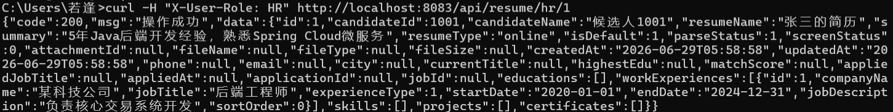
- [ ] 访问 `GET http://localhost:8083/actuator/sentinel`，在返回 JSON 中找到 talent-job 相关资源名，复制准确字符串。
- [ ] 将准确资源名填入 `SentinelRuleConfig.JOB_FEIGN_RESOURCES`（4 个方法对应资源），重启 talent-resume。
- [ ] 确认启动日志出现 `[Sentinel] 已加载 4 条 JobFeign 熔断降级规则`。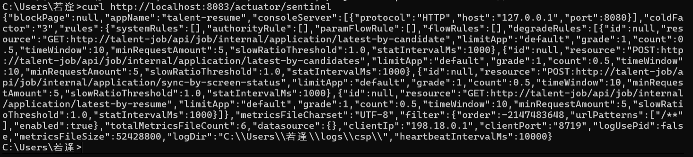

### 5.2 验证 A（读）：服务宕机降级 — 读接口

- [ ] 两服务正常时调简历详情，确认返回含投递信息（基线）。
- [ ] **停掉 talent-job**（故障注入：直接关闭进程）。
- [ ] 再次调简历详情接口。
- [ ] 预期：HTTP **不报 500**、简历详情正常返回但**无投递字段**；talent-resume 日志出现 `[Sentinel降级] JobFeignClient.getLatestApplicationByCandidate 触发降级 ...` WARN。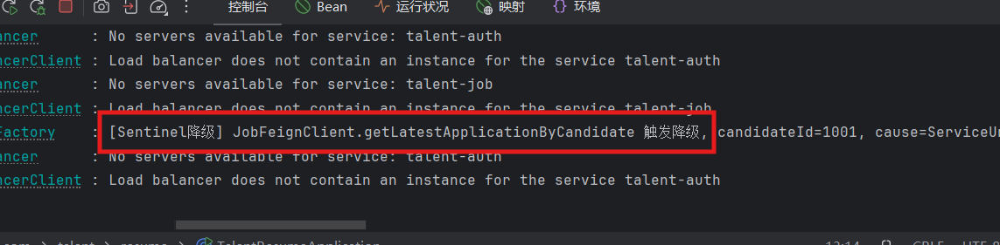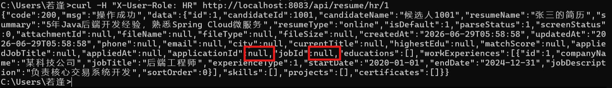

### 5.3 验证 A（写）：服务宕机降级 — 写接口（事务回滚）

- [ ] 在 talent-job 仍停机状态下，调用"HR 修改初筛状态"接口（走 `syncApplicationByScreenStatus`）。
- [ ] 预期：接口返回失败/"请稍后重试"，**resume 库中该简历的 screen_status 未发生变化**（事务回滚）；日志出现写方法降级 WARN。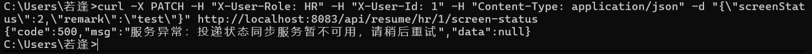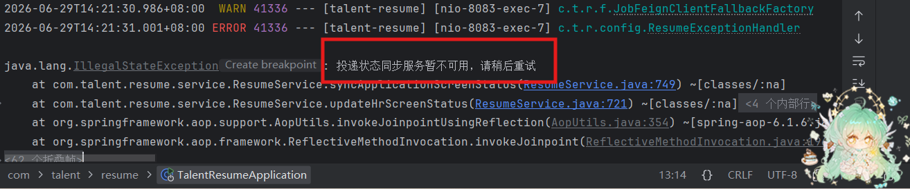
- [ ] 故障注入方式补充：也可不停机，让 job 内部接口临时抛异常/返回非 200 来触发。

### 5.4 验证 B：超时熔断 — Sentinel DegradeRule 触发

> 前提：5.1 已填好资源名并重启。

- [ ] 让 talent-job 持续报错/超时（故障注入：停机，或临时让 job 内部接口 `Thread.sleep` 超时 / 抛异常）。
- [ ] **在 1 秒内连续调用 ≥5 次**该 Feign 接口（满足 `minRequestAmount=5` 且异常比例≥50%）。
- [ ] 预期：达到阈值后熔断器 **OPEN**，后续 10s 内请求**直接走 fallback、无真实 HTTP 连接尝试**（对比熔断前日志有连接异常、熔断后只剩降级日志）。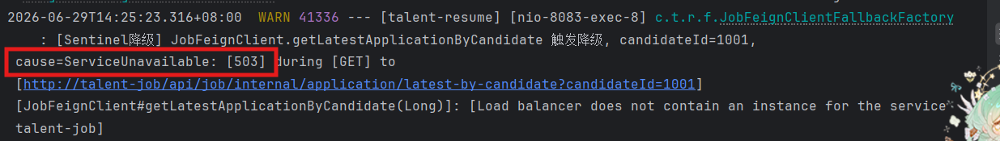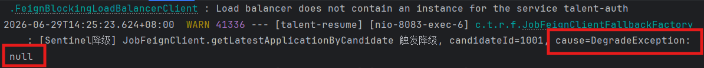
- [ ] 通过 `GET /actuator/sentinel` 查看该资源熔断状态/降级计数。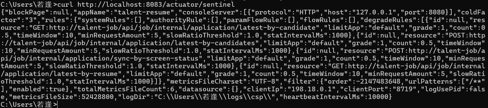](image-9.png)
- [ ] 10s 后半开放行一次探测；恢复 talent-job 后熔断关闭、调用恢复正常。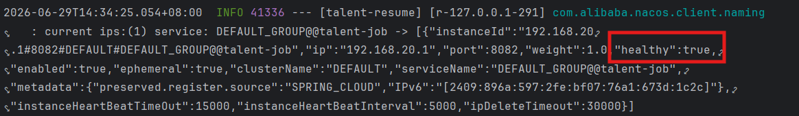

### 5.5 验证热更新：配置生效 + 业务不中断

- [ ] 启动压测脚本，持续对探针接口 `GET /api/resume/test/probe` 打流量（脚本见附录）。
- [ ] 压测进行中，在 Nacos 控制台 namespace `talent-ai-dev` 的 Data ID `talent-resume.yaml` 修改：
  ```yaml
  test:
    dynamic-value: HELLO_NACOS
  ```
  点"发布"。
- [ ] 预期：探针返回的 `value` 由 `INIT` 切换为 `HELLO_NACOS`（无需重启）；压测全程**错误率 0、无 5xx**（在途请求不被中断）。!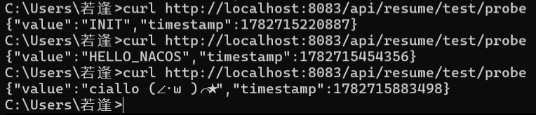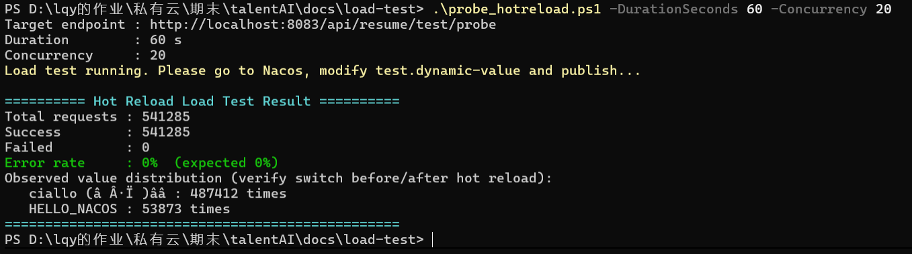

---

## 6. 测试结果

| 场景 | 预期 | 实际 | 是否通过 | 关键指标（错误率 / RT / 是否走 fallback） |
|------|------|------|----------|------------------------------------------|
| 3.1 Nacos 配置热更新 | 改配置后 value 切换、不重启、错误率 0 | 不重启服务，value 由 INIT→HELLO_NACOS→自定义值依次热切换；54 万次压测请求全部成功 | ✅ | 错误率 **0%**（541285/541285 成功，0 失败）/ value 切换：**是**（压测期间观测到新旧两个值平滑过渡） |
| 3.2 服务宕机 - 读降级 | 不报 500、无投递字段、WARN 日志 | 停掉 talent-job 后接口仍返回 200，投递字段为 null，控制台打印 `[Sentinel降级]` WARN | ✅ | 是否走 fallback：**是**（JobFeignClientFallbackFactory 接管）/ HTTP 状态：**200** |
| 3.2 服务宕机 - 写降级 | 返回"稍后重试"、状态未变(回滚) | 接口返回 `code:500 投递状态同步服务暂不可用，请稍后重试`；fallback 返回 503 触发 IllegalStateException，@Transactional 回滚，screen_status 保持 0 | ✅ | 是否回滚：**是**（screen_status 测前测后均为 0）/ 是否走 fallback：**是**（写方法降级 WARN） |
| 3.3 超时熔断 | 1s 内≥5 次失败后熔断 OPEN、直接走 fallback | 连续调用达到阈值后熔断器 OPEN，异常原因由 `ServiceUnavailable[503]` 转为 `DegradeException`，不再发起真实 HTTP 连接；job 恢复后熔断关闭、调用恢复正常 | ✅ | 熔断状态：**OPEN→恢复 CLOSED** / 规则：异常比例≥50%、minRequestAmount=5、timeWindow=10s / 表现：熔断后直接走 fallback（DegradeException） |

---

## 7. 发现的问题与改进建议（重点）

## 7. 发现的问题与改进建议

### 7.1 改造前系统完全缺失熔断降级机制（已修复）
改造前，各业务服务的 Feign 调用（如 `JobFeignClient`）未配置任何 fallback，
也未引入 Sentinel/Hystrix 等熔断组件。下游服务宕机或超时时，故障会沿调用链直接
向上扩散，存在服务雪崩风险。本次已为 talent-resume → talent-job 链路补齐
Sentinel 熔断 + Feign fallbackFactory，验证降级与熔断均生效。

### 7.2 跨服务写操作的降级策略：一致性优先（重点）
`syncApplicationByScreenStatus` 为跨服务写操作（resume 改初筛状态的同时需同步
通知 job 服务）。降级策略需在「可用性」与「一致性」间权衡：
- 若降级时伪造成功（返回 200），将导致 resume 库已更新、job 库未更新，
  且调用方无感知，形成永久性、静默的数据不一致；
- 本项目选择**一致性优先**：fallback 返回 503，由业务层抛出异常触发
  `@Transactional` 回滚，保证两库状态一致，并向 HR 返回"请稍后重试"的可感知提示。

实测验证：停掉 job 后调用改状态接口，接口返回失败提示，数据库 `screen_status`
保持原值未变（回滚成功）。建议后续如需兼顾可用性，可引入本地消息表 / 最终一致性
方案，将同步动作异步重试。

### 7.3 未配置 fallback 的 Feign 调用在依赖缺失时直接抛错（对比佐证）
测试中观察到，同样在依赖服务缺失时：
- 已配置 fallback 的 `JobFeignClient` → 优雅降级，返回兜底数据，主流程不受影响；
- 未配置 fallback 的 `AuthFeignClient` → 直接抛出 `No servers available for service: talent-auth`，
  无任何保护。
这一对比印证了熔断降级保护的必要性。**建议按本次 JobFeignClient 的样板，
为 AuthFeignClient 等其余 Feign 客户端统一补齐 fallback。**

### 7.4 写操作降级日志级别建议
当前写操作降级时，fallback 打印 WARN（符合预期），但业务层抛出的
`IllegalStateException` 被全局异常处理器记为 ERROR。该异常属于「可预期的降级结果」
而非系统故障，建议将此类降级链路的异常日志级别调整为 WARN，避免误触发
ERROR 级别的监控告警。

### 7.5 Nacos 配置中心使用情况说明
测试中发现各服务配置当前主要以本地 `application.yml` 默认值为主，Nacos 中
对应命名空间（`talent-ai-dev`）下配置较少。本次为验证 Nacos 配置热更新能力，
专门创建了 `talent-ai-dev` 命名空间及 `talent-resume.yaml` 探针配置进行测试，
验证了热更新生效（value 实时切换）且不中断业务（54 万次请求错误率 0%）。
建议后续将各服务的可变配置（如开关、阈值、限流参数）逐步迁移至 Nacos 统一管理。

### 7.6 网关层限流未覆盖（本轮范围外）
talent-gateway 基于 WebFlux，本轮未做网关层限流。如需补齐，应单独引入
`spring-cloud-starter-alibaba-sentinel-gateway`（reactive 适配版）并配置
`GatewayFlowRule`，与本轮业务服务的熔断降级是两套独立机制。

---

## 8. 结论

本轮以 `talent-resume → talent-job` 为样板，完成了三类异常场景的容错改造与可验证化：Nacos 配置热更新（`@RefreshScope` 探针）、服务宕机降级（Feign `fallbackFactory`）、服务超时熔断（Sentinel `DegradeRule`）。读操作采用可用性优先的空结果降级，写操作采用一致性优先的回滚降级。系统在依赖故障下具备"不扩散、可兜底、能熔断、配置热更新不中断业务"的容错能力。后续将补齐网关限流与其余 Feign 客户端的降级覆盖。

---

## 附录：压测脚本（热更新期间持续打流量，验证错误率为 0）

见同目录脚本说明与 `docs/load-test/` 下脚本文件。运行方法见脚本头部注释。
