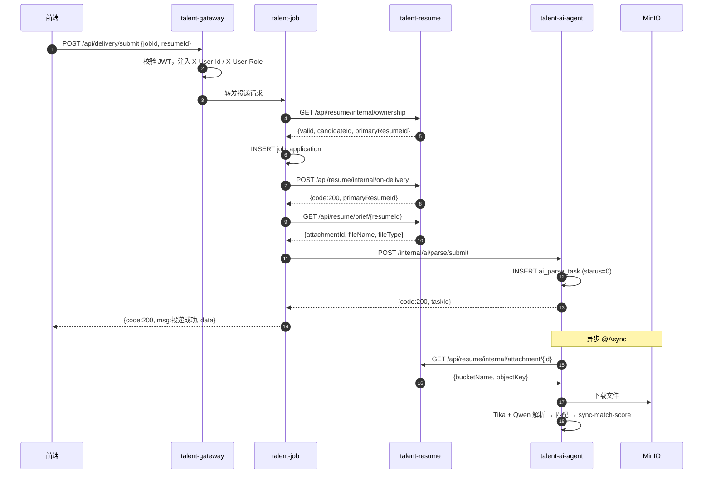

# 智能招聘与人才画像分析系统 — 本地部署与接入指南

> 从零开始：Git 拉取 → Docker 基础设施 → 数据库 → 后端 → 前端 → AI Key → API 接入  
> 适用系统：**Windows 10/11**（Mac/Linux 步骤类似，命令自行替换路径）  
> 网关入口：`http://localhost:8080`

---

## 目录

**第一部分：环境部署**

1. [环境要求](#一环境要求)
2. [克隆项目](#二克隆项目)
3. [安装 Docker Desktop](#三安装-docker-desktop)
4. [启动基础设施](#四启动基础设施)
5. [配置 Nacos 命名空间](#五配置-nacos-命名空间)
6. [初始化 MySQL 数据库](#六初始化-mysql-数据库)
7. [MySQL 与后端配置对照](#七mysql-与后端配置对照)
8. [编译后端](#八编译后端)
9. [配置 DashScope API Key](#九配置-dashscope-api-key)
10. [启动后端微服务](#十启动后端微服务)
11. [启动前端](#十一启动前端)
12. [验证与访问地址](#十二验证与访问地址)
13. [部署常见问题](#十三部署常见问题)

**第二部分：API 接入**

14. [API 总体架构](#十四api-总体架构)
15. [统一响应格式](#十五统一响应格式)
16. [前端接入规范](#十六前端接入规范)
17. [后端 Feign 规范](#十七后端-feign-规范)
18. [核心业务：投递触发 AI](#十八核心业务投递触发-ai)
19. [完整时序图](#十九完整时序图)
20. [常用 API 速查](#二十常用-api-速查)
21. [接入自检清单](#二十一接入自检清单)

**附录**

- [端口总览](#附录端口总览)
- [相关文档](#附录相关文档)

---

# 第一部分：环境部署

## 一、环境要求

| 软件 | 推荐版本 | 用途 |
|------|----------|------|
| Git | 最新版 | 拉取代码 |
| JDK | **17** | 后端 Spring Boot 3 |
| Maven | 3.9+ | 后端编译 |
| Docker Desktop | 最新版 | MySQL / Redis / Nacos / MinIO |
| Node.js | **18+** | 前端 Vite |
| MySQL 客户端 | 可选 | 执行 SQL（或用 Docker 内 mysql 命令） |

验证命令：

```powershell
git --version
java -version      # 应显示 17.x
mvn -version
docker --version
node -v            # 应 >= 18
npm -v
```

---

## 二、克隆项目

```powershell
# 任选目录，例如桌面
cd $HOME\Desktop

# HTTPS（无需配置 SSH Key）
git clone https://github.com/DDYQ707/talentAI.git talent-ai-system

# 或 SSH
git clone git@github.com:DDYQ707/talentAI.git talent-ai-system

cd talent-ai-system

# 切换到开发分支（以仓库实际分支为准，当前主开发分支为 feature/recruit-dashboard）
git checkout feature/recruit-dashboard
git pull
```

### 项目目录结构

```
talent-ai-system/
├── docker/                  # Docker Compose（Redis / Nacos / MinIO；MySQL 用本机 3306）
├── docs/
│   └── sql/                 # 7 库全量快照 + init_all.sql（见 README.md）
├── talent-ai-backend/       # Java 微服务（网关 + 8 个业务模块）
└── talent-ai-front/         # Vue3 前端
```

---

## 三、安装 Docker Desktop

1. 下载安装：[Docker Desktop for Windows](https://www.docker.com/products/docker-desktop/)
2. 管理员 PowerShell 执行（首次安装 WSL2 时）：

```powershell
wsl --install
wsl --update
wsl --set-default-version 2
```

3. 打开 Docker Desktop → 设置中勾选 **Use WSL 2 based engine**
4. 等待左下角状态为 **Engine running**

---

## 四、启动基础设施

**MySQL 使用本机安装（端口 3306）**，不在 Docker 中运行。  
Redis、Nacos、MinIO **必须用 Docker 启动**（见 `docker/docker-compose.yml`）。

```powershell
cd talent-ai-system\docker
docker compose up -d
docker ps
```

应看到 3 个容器均为 Up：`talent-redis`、`talent-nacos`、`talent-minio`。

### 4.1 容器与端口

| 容器名 | 服务 | 宿主机端口 | 默认账号 |
|--------|------|------------|----------|
| talent-redis | Redis 7 | **6380** → 6379 | 无密码 |
| talent-nacos | Nacos 2.3 | **8848**、9848、9849 | nacos / nacos |
| talent-minio | MinIO | **9000**、**9001** | minioadmin / minioadmin |

> `docker/mysql/init.sql` 仅作参考（列出 7 个库名），**不会**随 Compose 自动执行。表结构与种子数据请用第六节 `init_all.sql` 导入本机 MySQL。

### 控制台快捷入口

- Nacos：http://localhost:8848/nacos
- MinIO：http://localhost:9001

---

## 五、配置 Nacos 命名空间

后端所有服务注册在命名空间 **`talent-ai-dev`**，首次使用需手动创建：

1. 打开 http://localhost:8848/nacos ，登录 `nacos` / `nacos`
2. 左侧 **命名空间** → **新建命名空间**
3. 命名空间 ID 填：`talent-ai-dev`（名称可填「本地开发」）
4. 保存

> 配置列表为空是正常的，当前路由写在 `talent-gateway` 的 `application.yml` 中。Nacos 里配置数为 0 也正常——AI Key 等来自本机环境变量 + 各服务 `application.yml`，无需在 Nacos 手动上传配置。

---

## 六、初始化 MySQL 数据库

脚本位于 `docs/sql/`，每个文件含 **CREATE DATABASE + 表结构 + 演示种子数据**（2026-07-01 全量快照）。  
**在本机 MySQL 3306 上执行**，密码需与第七节 `application.yml` 一致（默认 `dyq!`）。

详细说明见 [docs/sql/README.md](docs/sql/README.md)。

### 6.1 一键导入（推荐）

在项目根目录执行：

```bash
cd talent-ai-system
mysql -h127.0.0.1 -P3306 -uroot -p --default-character-set=utf8mb4 -e "source docs/sql/init_all.sql"
```

PowerShell 同上（将 `-p` 后换成你的密码）。

> 不要用 `Get-Content ... | mysql` 导入（易导致中文乱码），请用 `source` 或 `< file.sql` 重定向。

### 6.2 按库单独导入（可选）

```bash
mysql -h127.0.0.1 -P3306 -uroot -p --default-character-set=utf8mb4 < docs/sql/talent_auth_db.sql
mysql -h127.0.0.1 -P3306 -uroot -p --default-character-set=utf8mb4 < docs/sql/talent_admin_db.sql
mysql -h127.0.0.1 -P3306 -uroot -p --default-character-set=utf8mb4 < docs/sql/talent_job_db.sql
mysql -h127.0.0.1 -P3306 -uroot -p --default-character-set=utf8mb4 < docs/sql/talent_resume_db.sql
mysql -h127.0.0.1 -P3306 -uroot -p --default-character-set=utf8mb4 < docs/sql/talent_interview_db.sql
mysql -h127.0.0.1 -P3306 -uroot -p --default-character-set=utf8mb4 < docs/sql/talent_ai_db.sql
mysql -h127.0.0.1 -P3306 -uroot -p --default-character-set=utf8mb4 < docs/sql/talent_pool_db.sql
```

### 6.3 演示账号（已含在 SQL 快照中，无需额外 seed 脚本）

| 账号 | 密码 | 说明 |
|------|------|------|
| admin | 123456 | 管理员 |
| hr@company.com | 123456 | HR 演示 |
| interview@company.com | 123456 | 面试官 |
| 13910001001 ~ 009 | 123456 | 候选人（手机号登录） |
| 13500001005 | 123456 | 陈磊（产品经理） |

> **MinIO**：SQL 不含简历 PDF 文件。若附件下载 404，需还原 MinIO 桶 `talent-resumes`，或在前端重新上传简历。

### 6.4 库与服务对照

| 数据库 | 微服务 | 端口 | SQL 脚本 |
|--------|--------|------|----------|
| talent_auth_db | talent-auth | 8081 | talent_auth_db.sql |
| talent_admin_db | talent-admin | 8088 | talent_admin_db.sql |
| talent_job_db | talent-job | 8082 | talent_job_db.sql |
| talent_resume_db | talent-resume | 8083 | talent_resume_db.sql |
| talent_interview_db | talent-interview | 8085 | talent_interview_db.sql |
| talent_ai_db | talent-ai-agent | 8084 | talent_ai_db.sql |
| talent_pool_db | talent-talent-pool | 8086 | talent_pool_db.sql |

### 6.5 验证

```sql
SHOW DATABASES LIKE 'talent_%';
SELECT COUNT(*) FROM talent_auth_db.sys_user;
```

应看到 7 个库，且各库内有对应表与演示数据。

---

## 七、MySQL 与后端配置对照

**原则：SQL 导入端口 = `application.yml` 里 JDBC 端口 = 本机 MySQL 实例（3306）。**

各服务默认配置：

```yaml
spring:
  datasource:
    url: jdbc:mysql://127.0.0.1:3306/talent_xxx_db?...
    username: root
    password: dyq!    # 改成你本机 MySQL 的 root 密码
```

只需保证：

1. 本机 MySQL 服务已启动（Windows 服务或 `net start mysql`）
2. 第六节 SQL 用 **`-P3306`** 导入
3. 以下文件的 `password` 与 root 密码一致（`talent-admin` 含 4 个数据源，改一处即可）：

| 文件 |
|------|
| `talent-ai-backend/talent-auth/src/main/resources/application.yml` |
| `talent-ai-backend/talent-job/src/main/resources/application.yml` |
| `talent-ai-backend/talent-resume/src/main/resources/application.yml` |
| `talent-ai-backend/talent-ai-agent/src/main/resources/application.yml` |
| `talent-ai-backend/talent-interview/src/main/resources/application.yml` |
| `talent-ai-backend/talent-talent-pool/src/main/resources/application.yml` |
| `talent-ai-backend/talent-admin/src/main/resources/application.yml` |

`talent-auth`、`talent-admin` 的 Redis 仍连 Docker（6380）：

```yaml
spring:
  data:
    redis:
      host: 127.0.0.1
      port: 6380
```

`talent-analytics` **无数据库**，通过 Feign 聚合其他服务数据，无需改 JDBC。

### 如何确认数据库已就绪

```powershell
mysql -h127.0.0.1 -P3306 -uroot -p -e "SHOW DATABASES LIKE 'talent_%';"
```

后端启动报错 `Communications link failure` 时，多半是 **MySQL 未启动** 或 **yml 密码与 root 不一致**。

---

## 八、编译后端

```powershell
cd talent-ai-system\talent-ai-backend
mvn clean install -DskipTests
```

首次编译需下载依赖，耗时约 3～10 分钟。看到 **BUILD SUCCESS** 即可。

---

## 九、配置 DashScope API Key

`talent-ai-agent` 调用通义千问（Qwen-Max），需配置环境变量 **`DASHSCOPE_API_KEY`**。  
本项目**不会**把 Key 写进代码或 Git，每人使用自己的百炼 Key。

配置入口（`talent-ai-agent/src/main/resources/application.yml`）：

```yaml
ai:
  dashscope:
    api-key: ${DASHSCOPE_API_KEY}
    base-url: https://dashscope.aliyuncs.com/compatible-mode/v1
    model: qwen-max
    timeout-seconds: 60
```

> 不启动 AI 服务也可登录、浏览岗位；投递后的 AI 解析/匹配功能需要此 Key。

### 9.1 申请 API Key

1. 打开 [阿里云百炼控制台 → API-KEY 管理](https://bailian.console.aliyun.com/#/api-key)
2. 点击 **「+ 创建 API Key」**
3. 填写描述（如：`张三-本地开发`）
4. 创建成功后复制**完整**字符串（一般以 `sk-` 开头）

> **注意**
>
> - 必须使用 **百炼 / 模型服务灵积** 的 API Key，**不能**用阿里云控制台「AccessKey 管理」里的 AccessKey ID / Secret。
> - 不要把 Key 发到群聊、不要提交到 Git、不要写进 `application.yml`。

### 9.2 本地配置（三选一）

环境变量必须配置在 **启动 `talent-ai-agent` 的进程** 里。只在测试用的 PowerShell 窗口里设置，对 IDEA 里点的 Run **无效**。

#### 方式 A：IntelliJ IDEA（推荐）

1. 右上角运行配置下拉 → **Edit Configurations…**
2. 左侧选中 **AiAgentApplication**
3. 若看不到「环境变量」，点击 **「修改选项(M)」** → 勾选 **「环境变量」**
4. 在 **环境变量(E)** 中填写：

   ```text
   DASHSCOPE_API_KEY=sk-你的完整密钥
   ```

5. 点击 **应用 → 确定**
6. **Stop 停掉旧进程 → 再 Run 启动**（改环境变量后必须完全重启）

#### 方式 B：PowerShell 终端启动

```powershell
cd talent-ai-system\talent-ai-backend

$env:DASHSCOPE_API_KEY = "sk-你的完整密钥"
mvn -pl talent-ai-agent spring-boot:run
```

#### 方式 C：系统环境变量（不推荐，易忘）

Windows「系统属性 → 环境变量」中添加 `DASHSCOPE_API_KEY`，需重启 IDEA 后生效。

### 9.3 启动日志确认

服务启动后，在控制台搜索：

```text
DashScope 配置已加载
```

正常示例：

```text
DashScope 配置已加载: model=qwen-max, baseUrl=https://dashscope.aliyuncs.com/compatible-mode/v1, apiKeyLength=35, apiKeyPrefix=sk-abc12...
```

| 日志现象 | 含义 |
|----------|------|
| `apiKeyPrefix=sk-...` 与百炼控制台一致 | Key 已读对 |
| `DashScope API Key 未配置` | 环境变量没传到 Java 进程 |
| `格式异常：应以 sk- 开头` | 可能用了 AccessKey，不是百炼 Key |

### 9.4 验证 Key 是否有效

建议分两步：**先直连阿里云**，再测本项目接口。

**第一步：PowerShell 直连 DashScope（不经过 Java）**

```powershell
$headers = @{
  Authorization = "Bearer sk-你的完整密钥"
  "Content-Type" = "application/json"
}

$body = @{
  model = "qwen-max"
  messages = @(
    @{ role = "user"; content = "hi" }
  )
} | ConvertTo-Json -Depth 5 -Compress

Invoke-RestMethod -Method Post `
  -Uri "https://dashscope.aliyuncs.com/compatible-mode/v1/chat/completions" `
  -Headers $headers `
  -Body $body
```

- **成功**：返回带 `choices` 的 JSON
- **`invalid_api_key`**：Key 无效，回 9.1 重新申请

**第二步：测 talent-ai-agent 测试接口（直连 8084）**

确保 `talent-ai-agent` 已启动：

```powershell
Invoke-RestMethod -Method Post -Uri "http://127.0.0.1:8084/api/ai/test/chat" `
  -ContentType "application/json" `
  -Body '{"prompt":"请只返回：AI服务连接成功"}'
```

期望响应：

```json
{
  "code": 200,
  "msg": "操作成功",
  "data": { "content": "AI服务连接成功" }
}
```

**第三步（可选）：经网关 + JWT 测试**

经网关访问 `/api/ai/**` 需要登录 Token。Postman：`POST http://127.0.0.1:8080/api/ai/test/chat`，Header 加 `Authorization: Bearer <JWT>`。

### 9.5 AI Key 常见问题

| 问题 | 处理 |
|------|------|
| `invalid_api_key` | 确认是百炼 `sk-` Key；IDEA 环境变量填对并重启 |
| `DASHSCOPE_API_KEY 未配置` | 必须在 **启动服务的进程** 里配置 Key |
| PowerShell 直连成功，Java 失败 | 看启动日志 `apiKeyPrefix` 是否与 Key 一致 |
| Maven 编译「无效的目标发行版: 17」 | 将 `JAVA_HOME` 指向 JDK 17 或 21 |

### 9.6 安全规范

1. **禁止** 将 API Key 写入 `application.yml`、Java 代码或提交 Git
2. **禁止** 在截图、文档、群聊中暴露完整 Key
3. 若 Key 曾泄露，立即在百炼控制台 **禁用 / 删除并重建**
4. 每人使用 **自己的** Key，便于用量与权限隔离

### 9.7 AI Key 验收清单

- [ ] 已在百炼控制台创建 **自己的** API Key（`sk-` 开头）
- [ ] 已在 IDEA 或终端配置 `DASHSCOPE_API_KEY`，且 **未** 写入 Git
- [ ] 启动日志出现 `DashScope 配置已加载`，`apiKeyPrefix` 正确
- [ ] PowerShell 直连 DashScope 返回 `choices`
- [ ] `POST http://127.0.0.1:8084/api/ai/test/chat` 返回 `code: 200`

---

## 十、启动后端微服务

### 10.1 启动顺序

按以下顺序在 IDEA 中运行各模块的 `main` 方法（或 `spring-boot:run`）：

| 顺序 | 模块 | 启动类 | 端口 | 说明 |
|------|------|--------|------|------|
| 1 | talent-gateway | `GatewayApplication` | **8080** | API 网关，必启 |
| 2 | talent-auth | `AuthApplication` | 8081 | 登录/注册，必启 |
| 3 | talent-job | `TalentJobApplication` | 8082 | 岗位/投递/Offer，必启 |
| 4 | talent-resume | `TalentResumeApplication` | 8083 | 简历/MinIO，必启 |
| 5 | talent-ai-agent | `AiAgentApplication` | 8084 | AI 解析/匹配/知识库，必启 |
| 6 | talent-interview | `TalentInterviewApplication` | 8085 | 面试，必启 |
| 7 | talent-talent-pool | `TalentPoolApplication` | 8086 | HR 人才库，建议启 |
| 8 | talent-analytics | `AnalyticsApplication` | 8087 | HR 工作台/驾驶舱聚合，建议启 |
| 9 | talent-admin | `TalentAdminApplication` | 8088 | 管理端 `/admin/**`，使用管理后台必启 |

> 最少可只启前 6 项 + 网关，能完成登录、投递、面试主流程；**管理后台**需 `talent-admin`，**HR 人才库/工作台图表**需 `talent-talent-pool`、`talent-analytics`。

### 10.2 IDEA 批量导入

1. **File → Open** → 选择 `talent-ai-backend/pom.xml` → Open as Project
2. 等待 Maven 索引完成
3. 对每个模块右键 `*Application.java` → **Run**

### 10.3 命令行启动（示例）

```powershell
cd talent-ai-system\talent-ai-backend

mvn -pl talent-gateway spring-boot:run
mvn -pl talent-auth spring-boot:run
mvn -pl talent-job spring-boot:run
mvn -pl talent-resume spring-boot:run

$env:DASHSCOPE_API_KEY = "sk-你的密钥"
mvn -pl talent-ai-agent spring-boot:run

mvn -pl talent-interview spring-boot:run
mvn -pl talent-talent-pool spring-boot:run
mvn -pl talent-analytics spring-boot:run
mvn -pl talent-admin spring-boot:run
```

### 10.4 确认 Nacos 注册

打开 Nacos → **服务管理 → 服务列表** → 命名空间选 `talent-ai-dev`，应看到 **8～9 个**服务均为健康实例（含 `talent-gateway`、`talent-admin`、`talent-talent-pool`、`talent-analytics` 等）。

---

## 十一、启动前端

```powershell
cd talent-ai-system\talent-ai-front
npm install
npm run dev
```

终端会输出本地地址，一般为：**http://localhost:5173**

前端通过 Vite 代理将 `/api` 转发到网关 `http://localhost:8080`，无需单独配置 CORS。

---

## 十二、验证与访问地址

### 12.1 启动检查清单

- [ ] `docker ps` 中 Redis / Nacos / MinIO 均为 Up
- [ ] 本机 MySQL 3306 已导入 7 个库（`init_all.sql`）
- [ ] Nacos 命名空间 `talent-ai-dev` 已创建
- [ ] 网关 + 至少 6 个核心业务服务启动无报错（完整体验需 9 个，见第十节）
- [ ] Nacos 服务列表可见 8～9 个实例
- [ ] 前端 `npm run dev` 可访问
- [ ] 使用 admin / 123456 或演示账号可登录
- [ ] （可选）AI 测试接口返回 200（见 [9.4](#94-验证-key-是否有效)）

### 12.2 访问入口

| 用途 | 地址 |
|------|------|
| 前端（默认） | http://localhost:5173 |
| API 网关 | http://localhost:8080 |
| Nacos 控制台 | http://localhost:8848/nacos |
| MinIO 控制台 | http://localhost:9001 |

### 12.3 角色与前端路由

| 角色 | user_type | 登录后路由 |
|------|-----------|------------|
| 候选人 | 1 | /candidate |
| HR | 2 | /hr |
| 面试官 | 3 | /interviewer |
| 管理员 | 4 | /admin |

### 12.4 快速接口测试

```powershell
# 网关存活（需 talent-gateway 已启动）
Invoke-WebRequest -Uri "http://localhost:8080/api/auth/login" -Method POST -Body "username=admin&password=123456" -ContentType "application/x-www-form-urlencoded"
```

---

## 十三、部署常见问题

### Q1：后端报 `Communications link failure` / 连不上 MySQL

1. 确认本机 MySQL（3306）已启动，且已执行第六节 `init_all.sql`
2. 对照第七节：各服务 `application.yml` 的 `password` 必须与本机 root 密码一致
3. 确认没有旧文档里的 Docker MySQL（3307）配置残留

### Q2：Nacos 注册失败 / 服务起不来

- 确认 Nacos 容器正常：http://localhost:8848/nacos
- 确认已创建命名空间 **`talent-ai-dev`**（ID 必须完全一致）
- 确认 9848、9849 端口未被占用

### Q3：前端报「无法连接服务器」

- 确认 **talent-gateway（8080）** 和 **talent-auth（8081）** 已启动
- 浏览器 F12 看请求是否打到 `localhost:5173/api/...`（由 Vite 代理到 8080）

### Q4：登录 401 / Token 无效

- 确认请求走网关 8080，不要直连 8081
- 清除浏览器 `localStorage` 中的 `talent_token` 后重新登录

### Q5：AI 解析 / 匹配不工作

- 确认 `talent-ai-agent` 已启动且配置了 `DASHSCOPE_API_KEY`（见 [第九节](#九配置-dashscope-api-key)）
- 确认 MinIO 正常（简历附件存储依赖 MinIO，桶名 `talent-resumes`）
- 投递需有 **PDF/Word 附件**；纯在线简历会跳过 AI 解析
- 异步任务需等待数十秒，查 `ai_parse_task` / `ai_match_record` 表状态

### Q6：管理后台 / HR 人才库 / 工作台报错 503

- `/admin/**` 需 **talent-admin（8088）** 已启动并在 Nacos 注册
- `/api/talent-pool/**` 需 **talent-talent-pool（8086）**
- `/api/analytics/**`（HR 工作台图表）需 **talent-analytics（8087）**

### Q7：MinIO 桶

- 桶名：`talent-resumes`
- `talent-resume` 服务首次上传附件时会自动创建，一般无需手动操作

---

# 第二部分：API 接入

> **适用对象**：前端开发、后端微服务开发

## 十四、API 总体架构

所有外部请求统一经过 **API 网关**（`talent-gateway:8080`），由网关完成 JWT 校验后，将用户信息写入请求头，再路由到各微服务。

```
┌─────────────┐     Bearer Token      ┌──────────────────┐
│ talent-ai-  │ ────────────────────► │ talent-gateway   │
│ front       │     /api/**           │ :8080            │
└─────────────┘                       └────────┬─────────┘
                                               │ lb:// 路由
                    ┌──────────────────────────┼──────────────────────────┐
                    ▼                          ▼                          ▼
            talent-auth              talent-job /              talent-resume
            /api/auth/**             talent-resume             /api/resume/**
                                     /api/job/**
                                     /api/delivery/**
                                               │
                                               ▼
                                       talent-ai-agent
                                       /api/ai/**（对外）
                                       /internal/ai/**（服务间）
```

### 14.1 网关路由表

| 路径前缀 | 目标服务 | 说明 |
|----------|----------|------|
| `/api/auth/**` | `talent-auth` | 登录、注册、账号管理 |
| `/api/job/**` | `talent-job` | HR 岗位 CRUD |
| `/api/delivery/**` | `talent-job` | 候选人投递 |
| `/api/offer/**` | `talent-job` | Offer 管理 |
| `/api/resume/**` | `talent-resume` | 简历上传、在线简历、HR 简历管理 |
| `/api/ai/**` | `talent-ai-agent` | AI 解析/匹配/知识库（HR 端） |
| `/internal/ai/**` | `talent-ai-agent` | **微服务内部** AI 触发（Feign） |
| `/api/interview/**` | `talent-interview` | 面试安排与评价 |
| `/internal/interview/**` | `talent-interview` | 服务间面试接口 |
| `/api/talent-pool/**` | `talent-talent-pool` | HR 人才库 |
| `/api/admin/**` | `talent-admin` | 管理端（账号/权限/大屏/风控等） |
| `/api/analytics/**` | `talent-analytics` | HR 工作台/驾驶舱聚合 |

### 14.2 鉴权与白名单

- **前端请求**：Header 携带 `Authorization: Bearer <JWT_TOKEN>`
- **网关校验通过后**：自动向下游注入
  - `X-User-Id`：当前用户 ID
  - `X-User-Role`：角色（如 `CANDIDATE`、`HR`、`ADMIN`）
- **白名单**（无需 Token）：`/api/auth/login`、`/api/auth/register`、`/internal/ai/**`

---

## 十五、统一响应格式

### 15.1 标准包装（`talent-common` 的 `R<T>`）

多数对外接口返回：

```json
{
  "code": 200,
  "msg": "操作成功",
  "data": { }
}
```

| code | 含义 |
|------|------|
| 200 | 成功 |
| 401 | 未登录或 Token 过期 |
| 403 | 无权限 |
| 400 / 404 / 409 / 500 | 业务或系统错误 |

### 15.2 特殊格式

部分早期接口（如 `talent-auth` 登录、`talent-job` 投递）直接在根级返回字段。登录接口额外在根级返回 `token`、`userInfo`（无 `data` 字段）。

### 15.3 内部接口（Feign）

`/internal/ai/**` 及 `/api/resume/internal/**` 使用 `Map<String, Object>`，约定：

```json
{ "code": 200, "msg": "ok", "data": { ... } }
```

失败时：`{ "code": 400, "msg": "错误原因" }`

---

## 十六、前端接入规范

### 16.1 请求封装

前端统一使用 `talent-ai-front/src/utils/request.js`：

- `baseURL`：开发环境走 Vite 代理至网关 `8080`
- 请求拦截：自动从 `localStorage.talent_token` 注入 `Authorization`
- 响应拦截：`code !== 200` 时 reject；有 `data` 则返回 `data`，否则返回整包

### 16.2 新增 API 的三步流程

**Step 1 — 在 `src/api/` 新建或扩展模块**

```typescript
// src/api/delivery.ts
import request from '@/utils/request'

export function submitApplication(payload: { jobId: number; resumeId: number; channel?: number }) {
  return request.post('/api/delivery/submit', payload)
}
```

**Step 2 — 在页面中调用**

```typescript
import { submitApplication } from '@/api/delivery'

const result = await submitApplication({ jobId: 1, resumeId: 2 })
// result 已是拦截器解包后的 data
```

**Step 3 — 配置 Vite 代理（开发环境）**

确保 `/api` 代理到 `http://localhost:8080`（网关）。

### 16.3 前端已对接 vs 待对接

| 模块 | 状态 | API 文件 |
|------|------|----------|
| 登录 / 注册 | ✅ 已对接 | `api/auth.ts` |
| 候选人岗位 / 投递 | ✅ 已对接 | `api/job.ts`、`api/delivery.ts` |
| 候选人档案 / 简历 | ✅ 已对接 | `api/candidateProfile.ts`、`api/resume.ts`、`api/onlineResume.ts` |
| HR 岗位 / 简历 | ✅ 已对接 | `api/hrJob.ts`、`api/hrResume.ts`、`api/hrCandidate.ts` |
| 管理员账号 | ✅ 已对接 | `api/adminAccount.ts` |
| AI 解析 / 匹配查询 | ✅ 已对接 | `api/ai.ts`（HR 简历详情页） |
| HR 工作台 / 面试 / Offer / 人才库 | ❌ Mock 数据 | 待后端服务就绪后对接 |

---

## 十七、后端 Feign 规范

### 17.1 服务间调用原则

- 跨服务只通过 **Feign + 内部 REST 接口**，禁止跨库 JOIN
- 内部路径统一前缀：`/api/{服务}/internal/**` 或 `/internal/ai/**`
- 投递、解析等长链路中，**非核心步骤失败不应回滚主事务**（如 AI 触发失败只记日志）

### 17.2 已有 Feign 客户端

| 调用方 | Feign 接口 | 被调服务 | 用途 |
|--------|-----------|----------|------|
| `talent-job` | `ResumeFeignClient` | `talent-resume` | 校验简历归属、投递后改初筛状态 |
| `talent-job` | `AuthFeignClient` | `talent-auth` | 查用户名、档案完整度 |
| `talent-job` | `AiFeignClient` | `talent-ai-agent` | 投递后触发 AI 解析 |
| `talent-resume` | `JobFeignClient` | `talent-job` | 查最新投递、同步初筛状态 |
| `talent-resume` | `AuthFeignClient` | `talent-auth` | 查候选人档案摘要 |
| `talent-ai-agent` | `ResumeFeignClient` | `talent-resume` | 查附件 MinIO 信息 |
| `talent-ai-agent` | `JobFeignClient` | `talent-job` | 查岗位 JD、回写 match_score |

### 17.3 新增 Feign 的标准步骤

**Step 1** — 在被调服务提供 internal 接口  
**Step 2** — 在调用方 `feign/` 包声明 `@FeignClient` 接口  
**Step 3** — 启动类加 `@EnableFeignClients`  
**Step 4** — 在业务 Service 中注入并调用

---

## 十八、核心业务：投递触发 AI

**当前状态：已打通。** 投递 → 文本抽取 → LLM 结构化 → 人岗匹配 → 回写 match_score 全链路已实现；HR 简历详情页（`ResumeDetailView`）已接入 `/api/ai/**` 展示匹配结果。

### 18.1 流程概览

```
候选人点击「确认投递」
    │
    ▼
POST /api/delivery/submit          ← 前端
    │
    ▼
talent-job：创建 job_application
    │
    ├─► POST /api/resume/internal/on-delivery   ← 改 screenStatus=待初筛
    │
    └─► POST /internal/ai/parse/submit          ← Feign 触发 AI 解析
            │
            ▼
        talent-ai-agent：创建 ai_parse_task，@Async 异步处理
            │
            ├─► GET /api/resume/internal/attachment/{id}   ← 查 MinIO 信息
            ├─► MinIO 下载 → Tika 抽文本 → Qwen 结构化 → ai_resume_parse_result
            ├─► POST /internal/ai/match/submit → Qwen 人岗匹配 → ai_match_record
            └─► Feign job sync-match-score → job_application.match_score
```

### 18.2 前端投递 API

| 项目 | 内容 |
|------|------|
| **方法 / 路径** | `POST /api/delivery/submit` |
| **Header** | `Authorization: Bearer <token>` |
| **Body** | `{ "jobId": 1, "resumeId": 2, "channel": 5 }` |
| **channel** | 1-BOSS 2-猎头 3-内推 4-智联 5-其他，可选，默认 5 |
| **前置条件** | 候选人已登录；个人档案已完善；简历归属当前用户；岗位状态为开放 |
| **成功响应 data** | `{ id, applicationNo, jobId, jobTitle, resumeId, currentStage, status, appliedAt }` |
| **常见错误** | 409 重复投递；400 档案未完善；403 非候选人角色 |

### 18.3 AI 解析触发 API（内部）

| 项目 | 内容 |
|------|------|
| **方法 / 路径** | `POST /internal/ai/parse/submit` |
| **调用方** | `talent-job` → `AiFeignClient` |
| **Body 主要字段** | `attachmentId`、`resumeId`、`applicationId`、`candidateId`、`fileName`、`fileType` |
| **成功返回 data** | `{ "taskId": 1, "resumeId": 2, "taskStatus": 0 }` |

**taskStatus：** 0 待处理 / 1 处理中 / 2 成功 / 3 失败

### 18.4 HR 查询 AI 结果（对外 API）

| 方法 / 路径 | 说明 |
|-------------|------|
| `GET /api/ai/parse/latest?resumeId=` | 查简历最新解析任务状态 |
| `GET /api/ai/match/by-application?applicationId=` | 查投递的人岗匹配结果 |
| `GET /api/ai/match/latest?resumeId=&jobId=` | 按简历+岗位查最新匹配 |
| `GET /api/ai/health` | 健康检查 |
| `POST /api/ai/test/chat` | LLM 连通性测试（需 Token 或直连 8084） |

**MatchResultVO 主要字段：**

```json
{
  "matchId": 1,
  "applicationId": 10,
  "matchScore": 85,
  "matchStatus": 2,
  "advantages": "[\"React 5年\", \"大厂背景\"]",
  "disadvantages": "[\"缺少高并发经验\"]"
}
```

### 18.5 验证投递 → AI 链路

1. 启动：`talent-gateway`、`talent-auth`、`talent-job`、`talent-resume`、`talent-ai-agent`（配置 `DASHSCOPE_API_KEY`）
2. 候选人登录 → 上传 PDF 简历 → 投递岗位
3. 查库 `ai_parse_task` 应有新记录，`task_status` 最终变为 2
4. 查 `ai_match_record.match_status` 为 2，`job_application.match_score` 有值
5. HR 打开简历详情页，或调 `GET /api/ai/match/by-application?applicationId=`

---

## 十九、完整时序图



---

## 二十、常用 API 速查

### 20.1 认证

| 方法 | 路径 | 说明 |
|------|------|------|
| POST | `/api/auth/login` | 密码登录，form：`username`、`password` |
| POST | `/api/auth/register` | 注册，form：`account`、`password` |

### 20.2 候选人

| 方法 | 路径 | 说明 |
|------|------|------|
| GET | `/api/job/list` | 岗位列表（开放中） |
| GET | `/api/job/{id}` | 岗位详情 |
| GET | `/api/delivery/my` | 我的投递记录 |
| POST | `/api/resume/file/upload` | 上传附件简历 |
| GET | `/api/resume/attachment/my` | 我的附件简历列表 |
| GET/POST | `/api/resume/online/**` | 在线简历 CRUD |

### 20.3 HR

| 方法 | 路径 | 说明 |
|------|------|------|
| GET/POST/PUT/DELETE | `/api/job/hr/**` | 岗位管理 |
| GET | `/api/resume/hr/page` | 简历分页列表 |
| GET | `/api/resume/hr/detail/{id}` | 简历详情 |
| PUT | `/api/resume/hr/screen-status` | 更新初筛状态 |
| GET | `/api/ai/match/by-application` | 查看 AI 匹配结果 |

---

## 二十一、接入自检清单

- [ ] 路径是否经过网关路由表？
- [ ] 前端是否在 `src/api/` 封装并统一走 `request.js`？
- [ ] 需登录接口是否携带 `Authorization`？
- [ ] 后端 Controller 是否读取 `X-User-Id` / `X-User-Role`？
- [ ] 跨服务调用是否用 Feign + internal 接口？
- [ ] 异步/非核心步骤失败是否不影响主流程？
- [ ] 响应 `code` 是否与前端拦截器约定一致（200 为成功）？

---

## 附录：端口总览

```
5173   talent-ai-front（Vite 开发服务器）
8080   talent-gateway（统一 API 入口）
8081   talent-auth
8082   talent-job
8083   talent-resume
8084   talent-ai-agent
8085   talent-interview
8086   talent-talent-pool
8087   talent-analytics
8088   talent-admin
3306   MySQL（本机，后端 application.yml 默认）
6380   Redis（Docker 映射）
8848   Nacos HTTP
9000   MinIO API
9001   MinIO 控制台
```

---

## 附录：相关文档

| 文档 | 说明 |
|------|------|
| [docs/sql/README.md](docs/sql/README.md) | 数据库脚本详细说明 |
| [docs/talent-gateway实现说明.md](docs/talent-gateway实现说明.md) | 网关路由与 JWT |
| [docs/talent-auth实现说明.md](docs/talent-auth实现说明.md) | 认证服务 |
| [docs/talent-job实现说明.md](docs/talent-job实现说明.md) | 岗位与投递 |
| [docs/talent-resume实现说明.md](docs/talent-resume实现说明.md) | 简历与 MinIO |
| [docs/talent-ai-agent实现说明.md](docs/talent-ai-agent实现说明.md) | AI 解析与匹配 |

> 原 `docs/API接入流程指南.md`、`docs/DashScope-API-Key本地接入指南.md` 已合并入本文档。
