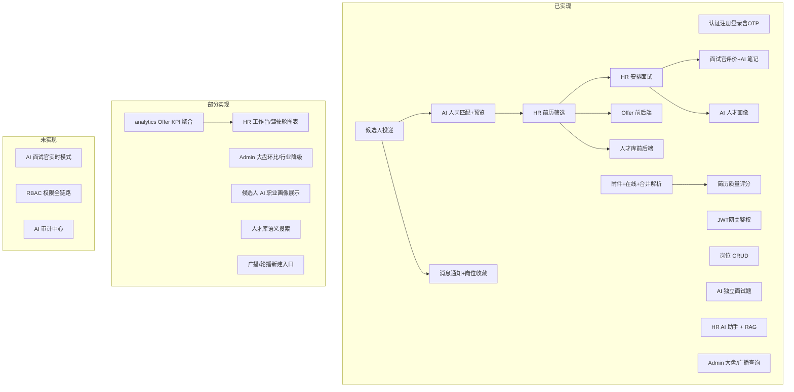

# 智能招聘与人才画像分析系统 — 项目进度与待完善清单

> **文档版本**：v6.0  
> **更新日期**：2026-06-27  
> **评估依据**：全量代码审查（前端 34 路由页 + 4 布局、后端 9 微服务 Controller/API、Mock/占位检索）

相关文档：

- [本地部署与接入指南](./智能招聘与人才画像分析系统%20本地部署指南.md)
- [Sprint2 面试任务清单](./Sprint2-interview任务清单.md)
- [数据库表结构设计](./数据库表结构设计.md)
- [AI 知识库维护手册](../talent-ai-backend/talent-ai-agent/src/main/resources/knowledge/README.md)

---

## 一、整体完成度概览

| 维度 | 完成度 | 说明 |
|------|--------|------|
| 架构与基础设施 | **~92%** | 9 微服务 + Docker（MySQL/Redis/Nacos/MinIO）、按服务拆库 DDL |
| 后端可运行服务 | **~90%**（9/9） | gateway / auth / job / resume / ai-agent / interview / talent-pool / analytics / **admin** 均可启动 |
| 核心业务链路 | **~95%** | 注册 → 登录（含 OTP）→ 发岗 → 投递 → 三源解析 → 匹配/预览 → 初筛 → 面试 → 评价 → 画像 → Offer/人才库 |
| 前端 UI | **~95%** | 四角色 **34 页** UI 完成；侧栏/Tab 文案以 `*Layout.vue` 为准 |
| 前后端联调 | **~87%** | **27 页完全对接**、**6 页部分对接**、**1 页纯 Mock**（见 §3.3） |
| AI 能力（MVP 核心） | **~92%** | 解析/匹配/预览/画像/出题/笔记/质量分/HR 助手/RAG 已通；**AI 面试官实时对话未做** |
| 面试 / Offer / 人才库 | **~88%** | 面试 MVP 闭环；Offer/人才库前后端已通；analytics **尚未聚合 Offer 统计** |
| RBAC 权限体系 | **~20%** | `init_permissions.sql` 有种子；`SysRoleController` 等为空壳；权限页纯静态 |
| **综合加权** | **~83–86%** | 主流程 + AI 全链路可演示；剩余缺口以看板细项、RBAC、布局占位为主 |

### 1.1 业务链路现状



### 1.2 MVP 目标对照

| MVP 能力 | 状态 | 备注 |
|----------|------|------|
| 简历解析 Agent | ✅ 已实现 | attachment / online / merged 三源；投递后异步 |
| 人岗匹配 Agent | ✅ 已实现 | 投递后回写 `match_score`；未投递可预览匹配 |
| 面试问题生成 Agent | ✅ 已实现 | `POST/GET /api/ai/interview-questions` |
| AI 面试笔记 | ✅ 已实现 | `POST/GET /api/ai/interview-notes` |
| 人才画像 Agent | ✅ 已实现 | HR 简历详情已对接；**候选人档案页未展示** |
| 简历质量评分 | ✅ 已实现 | 候选人简历页已对接 |
| HR AI 助手 | ✅ 已实现 | LangChain4j Tool Calling + SSE + RAG |
| Offer / 人才库 | ✅ 已实现 | 网关 + 前端已通；**analytics 漏斗 Offer 段仍为 0** |
| 四类角色动线 | ✅ 大部分 | 候选人/HR/面试官主流程可用；Admin 治理页已联调 |
| 验证码登录 | ✅ 已实现 | `LoginOtpService` + Redis/DB；实训 `dev-expose` 返回 devCode，**无真实短信/邮件** |
| JWT 网关鉴权 | ✅ 已实现 | `AuthGlobalFilter` 白名单 + Bearer 校验 + 下游 Header 透传 |
| AI 面试官实时模式 | ❌ 未实现 | 原 AIModeView 已移除，改为 AI 面试笔记半自动流程 |
| RBAC / AI 审计 | ❌ 未实现 | 权限页 Mock；`ai_audit_log` 无表无 API |

### 1.3 近期联调记录

| 日期 | 项 | 说明 |
|------|-----|------|
| 2026-06-22 | 在线/合并解析 | `parseSource=online/merged`；DDL 补丁 |
| 2026-06-23 | 简历质量评分 | `ai_resume_quality_score` 表 + 候选人简历页 |
| 2026-06-24 | 消息通知 / 收藏 / 匹配预览 | 候选人体验完善 |
| 2026-06-24 | Offer/人才库/看板 | 网关路由；HR 页面对接 analytics / offer / talent-pool |
| 2026-06-26 | AI 面试笔记 | `20260626_ai_interview_note.sql` |
| 2026-06-27 | 验证码登录 | auth `POST /api/auth/otp/send`、`/login/otp`；前端 `LoginView` 已对接 |
| 2026-06-27 | 文档 v6 对齐 | 侧栏文案、Mock 清单、OTP/JWT 状态与代码一致 |

**新环境必执行 SQL 补丁：**

- `20260624_sys_notification_patch.sql`
- `20260624_job_favorite_patch.sql`
- `20260623_ai_resume_quality_score.sql`（若库中无表）
- `20260626_ai_interview_note.sql`（若库中无表）

---

## 二、微服务模块完成度

### 2.1 总览矩阵

| 模块 | 端口 | 完成度 | 状态 |
|------|------|--------|------|
| talent-gateway | 8080 | ~95% | JWT 全局鉴权；Offer / talent-pool / analytics / admin 路由已配 |
| talent-auth | 8081 | ~82% | 密码/OTP 登录、候选人档案、通知 API；**RBAC Controller 空壳** |
| talent-job | 8082 | ~88% | 岗位 + 投递 + Offer + 收藏 + 通知触发 |
| talent-resume | 8083 | ~92% | 附件 + 在线 + 合并 + MinIO 预览/下载 |
| talent-ai-agent | 8084 | ~93% | 解析/匹配/预览/画像/出题/笔记/质量分/助手/RAG |
| talent-interview | 8085 | ~92% | 安排/评价/候选人端查询 MVP |
| talent-talent-pool | 8086 | ~80% | 分页/标签/状态筛选；**无语义搜索 API** |
| talent-analytics | 8087 | ~50% | KPI/漏斗 Feign 聚合；**Offer 统计/趋势/部门/渠道/待办未做** |
| talent-admin | 8088 | ~75% | 大盘/广播/账号/模型/企业审核/字典/岗位风险；**广播无新建 API** |

### 2.2 talent-ai-agent（~93%）

**已实现 API：**

| 端点 | 说明 |
|------|------|
| `POST /internal/ai/parse/submit` | attachment / online / merged |
| `GET/POST /api/ai/match/preview`、`/batch` | 未投递匹配预览 |
| `POST/GET /api/ai/resume-quality/*` | 简历质量评分 |
| `POST/GET /api/ai/interview-notes/*` | AI 面试笔记 |
| `POST/GET /api/ai/profile/*` | 人才画像 |
| `POST/GET /api/ai/interview-questions/*` | AI 面试题 |
| `POST /api/ai/chat/stream` | HR 助手 SSE |
| 知识库 Admin | import / reindex / docs |

**待完善：**

- `ai_audit_log` 审计落库与 Admin 审计页（路由暂注释）
- 画像/解析竞态：录用过快时的延迟重试
- 知识库 Markdown 增量同步

### 2.3 talent-analytics（~50%）

**已实现：**

- `GET /api/analytics/hr/dashboard`、`/hr/workbench` → Feign 聚合 job/resume/interview
- 返回：在招岗位、简历总量、月投递、初筛通过、面试进行中/完成、录用、漏斗前 3 段

**仍为占位（代码写死 0）：**

```java
// DashboardService.java
Long monthlyOfferSent = 0L;
Double offerAcceptRate = 0.0;
placeholderFields = ["monthlyOfferSent", "offerAcceptRate"]
```

**未实现 API：**

- 月度趋势 `trend?months=6`
- 部门进度 `dept-progress`
- 渠道分布 `channels`
- 工作台待办 `todos`（初筛/待安排面试/Offer 待审批等）

### 2.4 talent-admin（~75%）

| 能力 | 状态 |
|------|------|
| 数据大盘 `GET /api/admin/dashboard` | ✅ 用户/企业/投递/风控真查；**环比 % 后端写死**；行业为空时 mock 降级 |
| 轮播 `GET/PUT/DELETE /api/admin/banners` | ✅ 列表/上下线/删除；❌ **无 POST 新建** |
| 公告 `GET/POST/DELETE /api/admin/announcements` | ✅ 列表/广播/删除；❌ **无 POST 新建** |
| 账号 / AI 模型 / 企业审核 / 字典 / 岗位风险 | ✅ 前后端已通 |

### 2.5 其他模块

与 v5 基本一致，详见各服务 `docs/talent-*实现说明.md`。

**talent-auth RBAC：** 存在 `SysRole` / `SysPermission` 实体与 MyBatis 空 Controller（`/sysRole` 等），**无 REST CRUD、无鉴权注解联动**。

---

## 三、前端完成度

### 3.1 路由与侧栏对照（34 页 + 登录注册）

> 页面数以 `router/index.ts` 为准；**显示名称以各 Layout 侧栏/Tab 为准**（与 v5 文档旧称有差异）。

#### 公共

| 路由 | 组件 | 侧栏/入口 |
|------|------|-----------|
| `/login` | LoginView | — |
| `/register` | RegisterView | 登录页内切换 |

#### HR 门户（9 页）— `HRLayout.vue`

| 路由 | 组件 | 侧栏名称 |
|------|------|----------|
| `/hr` | HRWorkbenchView | 工作台 |
| `/hr/ai-assistant` | AIAssistantView | AI招聘助手 |
| `/hr/jobs` | JobsManagementView | 岗位管理 |
| `/hr/resumes` | ResumeManagementView | 简历管理 |
| `/hr/resumes/detail` | ResumeDetailView | （列表进入，无独立菜单） |
| `/hr/interviews` | InterviewManagementView | 面试管理 |
| `/hr/offers` | OfferManagementView | Offer管理 |
| `/hr/talent-pool` | TalentPoolView | 人才库 |
| `/hr/dashboard` | RecruitDashboardView | 数据驾驶舱 |

#### Admin 门户（8 页）— `AdminLayout.vue`

| 路由 | 组件 | 侧栏名称 |
|------|------|----------|
| `/admin/dashboard` | DashboardView | 数据大盘 |
| `/admin/broadcast` | BroadcastView | 广播中心 |
| `/admin/accounts` | AccountManagementView | 账号管理 |
| `/admin/permissions` | PermissionsView | 权限管理 |
| `/admin/ai-models` | AIModelsView | AI模型管理 |
| `/admin/enterprise-audit` | EnterpriseAuditView | 企业资质审核 |
| `/admin/data-dict` | DataDictView | 数据字典 |
| `/admin/job-risk` | JobRiskView | 职位风控 |
| ~~`/admin/audit`~~ | AuditView | ~~AI审计中心~~（路由已注释） |

#### 候选人门户（12 页）— `MobileLayout.vue` 底栏 4 Tab

| 路由 | 组件 | 入口 |
|------|------|------|
| `/candidate` | JobListView | Tab：首页 |
| `/candidate/job` | JobDetailView | 列表进入 |
| `/candidate/apply` | ApplyView | 投递流程 |
| `/candidate/applications` | ApplicationsView | Tab：投递记录 |
| `/candidate/interviews` | InterviewsView | 个人中心菜单 |
| `/candidate/interview` | InterviewDetailView | 面试列表进入 |
| `/candidate/resume` | ResumeView | Tab：我的简历 |
| `/candidate/resume/edit` | ResumeEditView | 简历页进入 |
| `/candidate/profile` | ProfileView | Tab：我的 |
| `/candidate/profile/edit` | ProfileEditView | 档案编辑 |
| `/candidate/notifications` | NotificationsView | 个人中心菜单 |
| `/candidate/favorites` | FavoritesView | 个人中心菜单 |

#### 面试官门户（3 页）— `InterviewerLayout.vue`

| 路由 | 组件 | 侧栏名称 |
|------|------|----------|
| `/interviewer` | InterviewListView | 面试列表 |
| `/interviewer/detail` | InterviewDetailView | 列表进入 |
| `/interviewer/notes` | InterviewNotesView | AI面试笔记 |

**路由守卫：** `router.beforeEach` 已实现登录校验 + 四角色门户隔离。

### 3.2 API 层（`src/api/`）

| 文件 | 域 | 状态 |
|------|-----|------|
| `auth.ts` | 密码登录、**OTP 发送/登录**、注册 | ✅ |
| `job.ts` / `hrJob.ts` | 岗位 CRUD | ✅ |
| `resume.ts` / `onlineResume.ts` / `hrResume.ts` | 简历 + MinIO 预览 | ✅ |
| `delivery.ts` / `favorite.ts` / `notification.ts` | 投递/收藏/通知 | ✅ |
| `candidateProfile.ts` / `hrCandidate.ts` | 候选人档案 | ✅ |
| `adminAccount.ts` / `adminAiModel.ts` / `adminDashboard.ts` / `adminDict.ts` / `adminEnterprise.ts` / `adminJobRisk.ts` | Admin 治理 | ✅ |
| `ai.ts` / `chat.ts` / `interview.ts` | AI / 助手 / 面试 | ✅ |
| `offer.ts` / `talentPool.ts` / `analytics.ts` | Offer / 人才库 / HR 看板 | ✅ |
| — | RBAC 权限矩阵 | ❌ 未定义 |
| — | AI 审计日志 | ❌ 未定义 |
| — | 广播/轮播 **新建** | ❌ 后端无 POST |

### 3.3 分页面数据对接

#### 公共 / 认证

| 页面 | 路由 | 状态 |
|------|------|------|
| 登录 | `/login` | ✅ 密码 + **验证码 OTP**（`sendLoginOtp` / `loginByOtp`） |
| 注册 | `/register` | ✅ |

#### 候选人门户

| 页面 | 路由 | 状态 |
|------|------|------|
| 首页（岗位列表） | `/candidate` | ✅ 搜索 + 部门 Tab + 收藏 + 匹配预览 |
| 岗位详情 | `/candidate/job` | ✅ 投递/收藏/匹配分；**分享按钮为占位** |
| 投递 / 投递记录 / 编辑简历 / 编辑档案 | 各路由 | ✅ |
| 我的面试 / 面试详情 | `/candidate/interviews` 等 | ✅ |
| 消息通知 / 我的收藏 | 各路由 | ✅ |
| 我的简历 | `/candidate/resume` | ⚠️ AI 质量分 ✅；**预览/下载按钮占位**（投递记录页附件预览 API 可用） |
| 个人档案 | `/candidate/profile` | ⚠️ 档案/统计/通知 ✅；**AI 职业画像、隐私设置、帮助与反馈为占位** |
| 投递页 | `/candidate/apply` | ⚠️ 主流程 ✅；**「AI 简历优化」占位** |
| 投递记录 | `/candidate/applications` | ⚠️ 列表 ✅；**「AI 跟进建议」占位** |

#### HR 门户

| 页面 | 路由 | 状态 |
|------|------|------|
| 岗位 / 简历列表 / 简历详情 | `/hr/jobs` 等 | ✅ 含匹配/画像/安排面试/发 Offer |
| 面试管理 / AI 助手 / Offer 管理 | 各路由 | ✅ |
| 人才库 | `/hr/talent-pool` | ⚠️ 分页/标签/状态 ✅；**顶栏语义搜索无后端 keyword** |
| 工作台 | `/hr` | ⚠️ KPI/漏斗 ✅；**趋势/部门/待办/AI 建议/洞察/欢迎语为硬编码** |
| 数据驾驶舱 | `/hr/dashboard` | ⚠️ KPI/漏斗 ✅；**趋势/部门/渠道图表硬编码** |

#### Admin / 面试官

| 页面 | 状态 |
|------|------|
| 账号 / AI 模型 / 企业审核 / 数据字典 / 职位风控 | ✅ |
| 数据大盘 | ⚠️ 调 `fetchDashboardData`；失败 fallback Mock；**后端环比写死** |
| 广播中心 | ⚠️ 列表/上下线/广播/删除 ✅；**无新建轮播/公告 UI 与 API**；失败 fallback Mock |
| 权限管理 | ❌ 角色/权限矩阵 **100% 静态** |
| 面试列表 / 详情 / AI 面试笔记 | ✅ |

### 3.4 四角色汇总

| 门户 | 页面数 | 已对接 | 部分对接 | 纯 Mock |
|------|--------|--------|----------|---------|
| Candidate | 12 | 9 | 3 | 0 |
| HR | 9 | 6 | 3 | 0 |
| Admin | 8 | 5 | 2 | 1 |
| Interviewer | 3 | 3 | 0 | 0 |
| 公共 | 2 | 2 | 0 | 0 |
| **合计** | **34** | **27** | **6** | **1** |

### 3.5 前端 Mock / 占位清单 — 做什么 & 怎么做

> **原则**：后端 API 已存在的优先对接；后端没有的先建 API 再改页面。

#### 3.5.1 汇总表

| 优先级 | 位置 | 路由/文件 | 现状 | 后端 API | 下一步 |
|--------|------|-----------|------|----------|--------|
| 🔴 P0 | analytics Offer KPI | HR 工作台/驾驶舱 | Offer 模块已有，漏斗 Offer 段仍为 0 | ⚠️ 缺 Feign | analytics 增加 OfferFeign，`monthlyOfferSent` / `offerAcceptRate` 真聚合 |
| 🟡 P1 | HR 工作台 | `/hr` `HRWorkbenchView.vue` | KPI/漏斗 ✅；趋势/部门/待办/AI 块 Mock | ⚠️ analytics 缺字段 | 扩展 analytics 或页面内多接口聚合 |
| 🟡 P1 | 数据驾驶舱 | `/hr/dashboard` | KPI/漏斗 ✅；趋势/部门/渠道 Mock | ⚠️ 同上 | 后端补 trend/dept/channel |
| 🟡 P1 | Admin 数据大盘 | `/admin/dashboard` | API ✅；overview 环比写死；失败 fallback Mock | ⚠️ 部分 | 历史快照或去掉假环比 |
| 🟡 P1 | 广播中心 | `/admin/broadcast` | 查询/操作 ✅；**无法新建** | ❌ 无 POST | admin 补 create API + 前端表单 |
| 🟢 P2 | 候选人 AI 职业画像 | `/candidate/profile` | 「敬请期待」 | ✅ profile API | 取最近投递 `applicationId` 调 `fetchAiProfileByApplication` |
| 🟢 P2 | 候选人简历预览/下载 | `/candidate/resume` | 按钮占位 | ✅ MinIO preview/download | 复用 `fetchResumePreview` / download API（投递记录页已有） |
| 🟢 P2 | 人才库语义搜索 | `/hr/talent-pool` | 搜索框无效果 | ❌ 无 keyword | talent-pool 加 keyword 或接 ai-agent 向量检索 |
| 🟢 P2 | 候选人小功能 | 投递/详情/档案 | AI 优化/跟进/分享/隐私/帮助 | ❌ | 按产品优先级择项实现或隐藏入口 |
| ⚪ P3 | 权限管理 | `/admin/permissions` | 静态矩阵 | ❌ Sys* 空壳 | auth RBAC CRUD + `adminPermission.ts` |
| ⚪ P3 | AI 审计中心 | `AuditView.vue` | 路由注释；页面全 Mock | ❌ | ai-agent 写 `ai_audit_log` + 分页 API + 恢复路由 |
| ⚪ P3 | AI 面试官实时 | — | 已移除 | ❌ | SSE/WebSocket 新会话（非 MVP） |
| ✅ 已完成 | OTP 登录 | `/login` | 前后端已通 | ✅ | 生产关闭 `dev-expose`，接入短信/邮件 |
| ✅ 已完成 | Offer/人才库/匹配/通知/收藏 | 多页 | 已对接 | ✅ | — |

#### 3.5.2 布局级占位（无独立路由）

| 文件 | 占位项 | 说明 |
|------|--------|------|
| `HRLayout.vue` | 顶栏搜索、通知红点、公司名「未来科技集团」 | 搜索无跳转；Bell 固定红点；公司名硬编码 |
| `HRWorkbenchView.vue` | 欢迎语「张招聘」「2024年6月14日」 | 应读 `auth.userInfo` + 当前日期 |
| `InterviewerLayout.vue` | 「李面试官 / 技术总监」、Bell 按钮 | 应读登录用户；通知未接 |
| `LoginView.vue` | 左侧 stats/features 文案 | 纯营销展示，非业务 Mock |

#### 3.5.3 HR 看板 Mock 明细（`HRWorkbenchView` / `RecruitDashboardView`）

| 区块 | 文件 | 数据类型 |
|------|------|----------|
| 招聘趋势折线图 | 两页 | 硬编码 6 个月序列 |
| 部门招聘进度 | 两页 | 硬编码部门目标/完成或缺口 |
| 渠道分布 | RecruitDashboardView | 硬编码 BOSS/猎头等 |
| 待办事项 | HRWorkbenchView | 硬编码 5 项计数 |
| AI 今日建议 / 快捷操作 / 洞察 | HRWorkbenchView | 硬编码；仅 AI 输入框 `@click` 跳转助手 |

#### 3.5.4 已对接页面（无需改 Mock）

**Candidate：** `JobListView`、`JobDetailView`（主流程）、`ApplyView`（主流程）、`ApplicationsView`（主流程）、`InterviewsView`、`InterviewDetailView`、`NotificationsView`、`FavoritesView`、`ProfileEditView`、`ResumeEditView`  
**HR：** `JobsManagementView`、`ResumeManagementView`、`ResumeDetailView`、`InterviewManagementView`、`AIAssistantView`、`OfferManagementView`  
**Interviewer：** `InterviewListView`、`InterviewDetailView`、`InterviewNotesView`  
**Admin：** `AccountManagementView`、`AIModelsView`、`EnterpriseAuditView`、`DataDictView`、`JobRiskView`  
**公共：** `LoginView`、`RegisterView`

---

## 四、基础设施与数据库

### 4.1 Docker 服务

| 服务 | 端口 | 状态 |
|------|------|------|
| MySQL 8.0 | 3306（本机）/ 3307（Docker） | ✅ |
| Redis 7 | 6380 | ✅ OTP 冷却/验证码缓存 |
| Nacos 2.3.2 | 8848 | ✅ |
| MinIO | 9000/9001 | ✅ 简历附件 |

### 4.2 数据库脚本（`docs/sql/`）

| 文件 | 用途 |
|------|------|
| 各 `talent_*_schema.sql` | 按服务拆库 |
| `20260622_ai_parse_task_online_patch.sql` | 在线解析 |
| `20260622_ai_knowledge_rag_patch.sql` | RAG 知识库 |
| `20260623_ai_resume_quality_score.sql` | 简历质量评分 |
| `20260624_sys_notification_patch.sql` | 系统通知 |
| `20260624_job_favorite_patch.sql` | 岗位收藏 |
| `20260626_ai_interview_note.sql` | AI 面试笔记 |

### 4.3 联调环境检查清单

| 检查项 | 说明 |
|--------|------|
| `DASHSCOPE_API_KEY` | ai-agent 必需 |
| Nacos 注册 | 含 **talent-admin**、**talent-analytics** |
| Redis 6380 | auth OTP 依赖 |
| SQL 补丁 | 新库按 §1.3 执行 |
| talent-auth OTP | `talent.auth.otp.dev-expose: true` 时响应含 devCode |

---

## 五、待完善内容（按优先级）

### 🔴 P0 — 演示一致性

| 项 | 实施要点 |
|----|----------|
| analytics 聚合 Offer | `DashboardService` 接 Offer Feign，去掉 `placeholderFields` |
| 新环境 SQL 补丁 | §1.3 四条按序执行 |
| 启动 talent-admin | Admin 大盘/广播依赖该服务 |

### 🟡 P1 — 体验闭环

- HR 工作台/驾驶舱：**趋势、部门、渠道、待办** 真实数据
- Admin 广播：**新建轮播/公告** API + 前端入口
- 候选人档案 **AI 职业画像**；简历页 **预览/下载** 对接已有 API
- HR 工作台欢迎语/布局公司名改为登录用户上下文

### 🟢 P2 — 治理与增强

| 项 | 说明 |
|----|------|
| RBAC / 权限页 | `PermissionsView` + auth 鉴权注解 |
| AI 审计中心 | `ai_audit_log` + 恢复 `/admin/audit` |
| 人才库语义搜索 | keyword 或向量检索 |
| 候选人占位入口 | AI 优化/跟进/分享/隐私/帮助 — 实现或隐藏 |
| AI 面试官实时模式 | 非 MVP |

---

## 六、推荐实施路线图

### Sprint 1–3（已完成）

- [x] 解析 → 匹配 → 投递 → 面试 → 画像全链路
- [x] HR AI 助手 + RAG + SSE
- [x] Offer + 人才库 + 网关 + 前端
- [x] 候选人：通知、收藏、匹配预览、面试页
- [x] AI 面试笔记、简历质量评分
- [x] HR 看板 KPI/漏斗（analytics 基础版）
- [x] Admin：账号/模型/企业审核/字典/岗位风险/大盘/广播查询
- [x] 前端路由守卫
- [x] **验证码 OTP 登录（2026-06-27）**

### Sprint 4（建议 3–5 天）

- [ ] analytics Offer 统计 + 趋势/部门/渠道/待办 API
- [ ] HR 两页图表 + 工作台待办替换硬编码
- [ ] 候选人 AI 职业画像 + 简历预览/下载
- [ ] Admin 广播新建 + RBAC 或审计（择优先）

**预估距完整 MVP 闭环：约 3–5 天**（以 analytics 补 Offer + 图表为主）

---

## 七、当前可演示流程

1. Docker + Nacos + MinIO + MySQL + Redis
2. 启动 gateway → auth → job → resume → ai-agent → interview → talent-pool → analytics → **admin**
3. 执行 §1.3 SQL 补丁（新库）
4. 登录：**密码或验证码**（devCode 或日志）
5. 候选人：浏览岗位 → 投递 → 通知 → 投递记录查看附件
6. HR：简历详情 → AI 匹配/画像 → 安排面试 → 发 Offer → 人才库
7. 面试官：AI 题 + 笔记 → 评价
8. HR：工作台/驾驶舱 **KPI/漏斗**、AI 助手
9. Admin：数据大盘、广播中心、账号/模型/审核/字典/风控

**暂不可完整演示：** 权限矩阵（Mock）、HR 趋势/渠道/待办（硬编码）、Offer 漏斗统计（analytics 为 0）、广播新建、AI 审计、AI 实时面试官

---

## 八、技术债清单

| 项 | 说明 |
|----|------|
| analytics Offer 未接 Feign | Offer 模块已有，看板 Offer 段仍为 0 |
| HR 两页图表 Mock | 趋势/部门/渠道/待办/AI 块硬编码 |
| Admin 大盘环比 | 后端写死 trend %；行业空则 mock |
| Admin 广播无 CRUD 新建 | 仅 list/status/delete/broadcast |
| 前端 1 页纯 Mock | `PermissionsView` |
| 布局占位 | HR 搜索/通知、面试官用户信息 |
| 候选人多处「敬请期待」 | 画像/预览/下载/小功能入口 |
| 人才库语义搜索 | UI 有、后端无 keyword |
| RBAC 空壳 Controller | 无 API、无注解鉴权 |
| 知识库增量同步 | 改 Markdown 需手动 reindex |
| 画像/解析竞态 | 录用过快时画像可能失败 |

---

## 九、总结

| 类别 | 结论 |
|------|------|
| **做得好的** | 投递→解析→匹配→面试→画像/Offer/人才库 全链路；OTP 登录、JWT 网关、MinIO 简历预览 |
| **v5→v6 修正** | OTP/JWT 已实现；侧栏名称与 Layout 对齐；补 talent-admin、布局占位、Offer analytics 缺口 |
| **最大缺口** | analytics **Offer KPI + 图表细项**、HR 工作台待办 |
| **次大缺口** | RBAC、AI 审计、候选人 AI 画像、广播新建 |
| **距完整 MVP** | 约 **3–5 天**（analytics 补全 + 择项治理） |

---

*文档维护：功能或 Mock 页对接完成后，请同步更新 §1 完成度、§3.3 对接表、§3.5 Mock 清单。*
