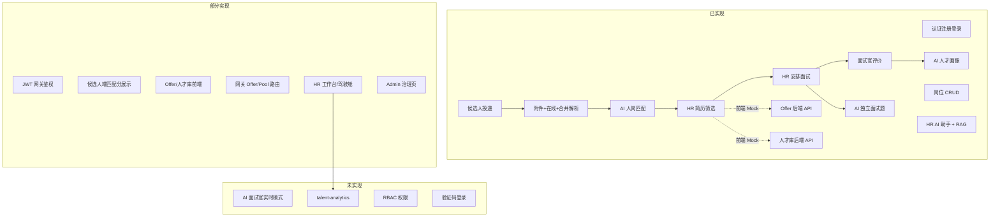

# 智能招聘与人才画像分析系统 — 项目进度与待完善清单

> **文档版本**：v4.0  
> **更新日期**：2026-06-22  
> **评估依据**：本地代码与联调记录（含在线/合并简历解析、人才画像、面试题生成、Feign 修复、SQL 补丁）

相关文档：

- [本地部署与接入指南](./智能招聘与人才画像分析系统%20本地部署指南.md)
- [Sprint2 面试任务清单](./Sprint2-interview任务清单.md)
- [数据库表结构设计](./数据库表结构设计.md)
- [AI 知识库维护手册](../talent-ai-backend/talent-ai-agent/src/main/resources/knowledge/README.md)

---

## 一、整体完成度概览

| 维度 | 完成度 | 说明 |
|------|--------|------|
| 架构与基础设施 | **~90%** | 9 微服务骨架、Docker（MySQL/Redis/Nacos/MinIO）、按服务拆库 DDL |
| 后端可运行服务 | **~78%**（7/9） | gateway / auth / job / resume / ai-agent / interview / talent-pool 可启动；analytics 仍占位 |
| 核心业务链路 | **~92%** | 注册 → 登录 → 发岗 → 投递 → **在线/附件/合并解析** → 匹配 → 初筛 → 面试 → 评价 → **画像** |
| 前端 UI | **~90%** | 四角色 27 页 UI 基本完成 |
| 前后端联调 | **~75%** | 约 16 页完全对接、4 页部分对接、**8 页仍为静态 Mock**（见 §3.5） |
| AI 能力（MVP 核心） | **~88%** | 解析（三源）/匹配/画像/独立出题/HR 助手/RAG 已通；**AI 面试官模式未做** |
| 面试 / Offer / 人才库 | **~55%** | 面试 MVP 已通；Offer/人才库**后端已有**，前端 Mock + 网关路由待补 |
| RBAC 权限体系 | **~20%** | 表结构有，管理端 API 与鉴权未落地 |
| **综合加权** | **~74–76%** | 主流程 + AI 全链路可演示；Offer/看板/Admin Mock 仍缺 |

### 1.1 业务链路现状



### 1.2 MVP 目标对照

| MVP 能力 | 状态 | 备注 |
|----------|------|------|
| 简历解析 Agent | ✅ 已实现 | **attachment / online / merged** 三源；投递后异步；写入 `ai_parse_task` / `ai_resume_parse_result` |
| 人岗匹配 Agent | ✅ 已实现 | 匹配分 + 优劣势 + 维度分 + 建议题；回写 `job_application.match_score` |
| 面试问题生成 Agent | ✅ 已实现 | `POST/GET /api/ai/interview-questions`；`InterviewDetailView` 已对接 |
| 人才画像 Agent | ✅ 已实现 | `POST/GET /api/ai/profile/*`；`ResumeDetailView` 生成/刷新画像；录用/淘汰可触发 |
| HR AI 助手 | ✅ 已实现 | LangChain4j Tool Calling + 多轮会话 + SSE + 候选人卡片 |
| RAG 知识库 | ✅ 已实现 | embedding + Markdown 种子 + Admin API |
| AI 面试官模式 | ❌ 未实现 | `AIModeView.vue` 仍为静态 Mock |
| 四类角色动线 | ⚠️ 大部分 | 候选人/HR/面试官主流程可用；Admin 除账号外多为原型 |

### 1.3 近期联调记录（2026-06-22）

| 项 | 说明 |
|----|------|
| 在线简历解析 | `parseSource=online`；DB 结构化映射，无需 PDF |
| 合并解析（方案 C） | 附件 LLM 为主 + 在线字段合并；`parseSource=merged` |
| **`attachment_id` 补丁** | 旧库 `ai_parse_task.attachment_id NOT NULL` 导致在线解析 500 → 执行 `docs/sql/20260622_ai_parse_task_online_patch.sql` |
| **talent-job Feign 冲突** | `AiFeignClient` 与 `AiAgentFeignClient` 同服务名 → 已加 `contextId` |
| 测试数据脚本 | `clear_candidate_business_data.sql`、`reset_seed_job_posts.sql`、`seed_candidate_13800138099.sql` |

---

## 二、微服务模块完成度

### 2.1 总览矩阵

| 模块 | 端口 | 完成度 | 状态 |
|------|------|--------|------|
| talent-gateway | 8080 | ~85% | 可用；缺 Offer/人才库路由 |
| talent-auth | 8081 | ~70% | 认证可用；RBAC/验证码未落地 |
| talent-job | 8082 | ~82% | 岗位+投递+Offer；Feign 已修 |
| talent-resume | 8083 | ~92% | 附件+在线+合并上下文 `getAiParseContext` |
| talent-ai-agent | 8084 | **~90%** | 解析/匹配/画像/出题/助手/RAG |
| talent-interview | 8085 | ~90% | 安排/评价 MVP |
| talent-talent-pool | 8086 | ~75% | 后端就绪；网关/前端未通 |
| talent-analytics | — | ~0% | 占位 |

### 2.2 talent-ai-agent（~90%）

**已实现 API（新增/更新）：**

| 端点 | 说明 |
|------|------|
| `POST /internal/ai/parse/submit` | 支持 `parseSource`: attachment / **online** / **merged** |
| `POST /api/ai/profile/generate` | 人才画像生成 |
| `GET /api/ai/profile/by-application` | 按投递查画像 |
| `POST /api/ai/interview-questions/generate` | AI 面试题生成 |
| `GET /api/ai/interview-questions?interviewId=` | 面试题列表 |
| `POST /api/ai/chat/stream` | HR 助手 SSE |
| 知识库 Admin | import / reindex / docs 列表 |

**简历解析三源逻辑：**

| resumeType | parseSource | 处理方式 |
|------------|-------------|----------|
| online | online | 在线 DB → `ParsedResumeDto` |
| attachment | attachment | MinIO → Tika → LLM |
| merged | merged | 附件 LLM + 在线合并（`ResumeParseMergeService`） |

**待完善：**

- `ai_audit_log` 审计落库与 Admin 页面对接
- 画像触发：解析未完成时的重试/延迟队列
- 知识库 Markdown 增量同步

### 2.3 talent-job（~82%）

**Feign 客户端（已修复 Bean 冲突）：**

| Client | contextId | 用途 |
|--------|-----------|------|
| AiFeignClient | `aiParseFeignClient` | 投递后触发解析 |
| AiAgentFeignClient | `aiProfileFeignClient` | 录用/淘汰触发画像 |

**待完善：** 网关 Offer 路由、HR Pipeline API、Offer 过期任务

### 2.4 talent-resume（~92%）

- `GET /api/resume/internal/ai-parse-context`：返回 `resumeType` = attachment / online / **merged**
- 在线简历与附件可并存；合并场景同时返回结构化字段 + 附件元数据

### 2.5 其他模块

与 v3.0 基本一致，详见各服务 `docs/talent-*实现说明.md`。  
**talent-interview**：评价 by-application 内部接口已供画像/出题使用。

---

## 三、前端完成度

### 3.1 路由总览（27 页）

| 路径 | 页面 | 布局 |
|------|------|------|
| `/login`、`/register` | 登录、注册 | 无 |
| `/hr/**` | 工作台、岗位、简历、面试、Offer、人才库、看板、AI 助手 | HRLayout |
| `/admin/**` | 权限、账号、AI 模型、审计 | AdminLayout |
| `/candidate/**` | 岗位、投递、简历、档案 | MobileLayout |
| `/interviewer/**` | 面试列表、详情、AI 模式 | InterviewerLayout |

### 3.2 API 层（`src/api/`）

**已定义：**

| 文件 | 域 |
|------|-----|
| `auth.ts` | 登录、注册 |
| `job.ts` / `hrJob.ts` | 岗位 CRUD |
| `resume.ts` / `onlineResume.ts` / `hrResume.ts` | 简历管理 |
| `delivery.ts` | 投递 |
| `candidateProfile.ts` / `hrCandidate.ts` | 候选人档案 |
| `adminAccount.ts` | 管理员账号 CRUD |
| `ai.ts` | 解析/匹配/**画像**/**面试题** |
| `interview.ts` | 面试安排/列表/评价 |
| `chat.ts` | AI 助手会话/流式 |

**未定义 API 域：** Offer、人才库、看板/工作台、权限/RBAC、AI 模型管理、审计日志、验证码登录

### 3.3 分页面数据对接

#### 公共 / 认证

| 页面 | 路由 | 状态 |
|------|------|------|
| 登录 | `/login` | ⚠️ 密码登录可用；验证码为 Mock |
| 注册 | `/register` | ✅ |

#### 候选人门户（~85%）

| 页面 | 路由 | 状态 |
|------|------|------|
| 岗位列表 | `/candidate` | ⚠️ 列表已接；搜索/分类 Tab 未参与 API |
| 岗位详情 | `/candidate/job` | ⚠️ AI 匹配分析区块为静态文案 |
| 投递 / 投递记录 / 编辑简历 / 编辑档案 | 各路由 | ✅ |
| 我的简历 | `/candidate/resume` | ⚠️ AI 分 88、建议标签硬编码 |
| 个人档案 | `/candidate/profile` | ⚠️ 通知 badge、AI 职业画像未接 |

#### HR 门户（~72%）

| 页面 | 路由 | 状态 |
|------|------|------|
| 岗位 / 简历列表 / 简历详情 | `/hr/jobs` 等 | ✅ 详情含匹配/雷达/优劣势/**画像**/**安排面试** |
| 面试管理 | `/hr/interviews` | ✅ |
| AI 助手 | `/hr/ai-assistant` | ✅ 流式 + 历史会话 |
| 工作台 | `/hr` | ❌ 静态 Mock |
| Offer 管理 | `/hr/offers` | ❌ 静态 Mock（后端已有） |
| 人才库 | `/hr/talent-pool` | ❌ 静态 Mock（后端已有） |
| 数据驾驶舱 | `/hr/dashboard` | ❌ 静态 Mock |

#### 管理员 / 面试官

| 页面 | 状态 |
|------|------|
| 账号管理 | ✅ |
| 权限 / AI 模型 / 审计 | ❌ 静态 Mock |
| 面试列表 / 详情 | ✅ 含 AI 分、**生成面试题**、评价 |
| AI 面试官模式 | ❌ 静态 Mock |

### 3.4 四角色汇总

| 门户 | 页面数 | 已对接 | 部分对接 | 纯静态 Mock |
|------|--------|--------|----------|-------------|
| Candidate | 8 | 5 | 3 | 0 |
| HR | 9 | 5 | 0 | 4 |
| Admin | 4 | 1 | 0 | 3 |
| Interviewer | 3 | 2 | 0 | 1 |
| **合计** | **24+登录注册** | **13** | **3** | **8** |

---

## 3.5 前端假数据（Mock）清单 — 做什么 & 怎么做

> **原则**：后端 API 已存在的优先对接；后端没有的先建 API 再改页面。  
> **改法通用步骤**：① 新建/补充 `src/api/*.ts` → ② 页面 `onMounted` 调接口替换硬编码数组 → ③ 按钮绑定 mutation → ④ 空态/加载/错误态。

### 3.5.1 汇总表

| 优先级 | 页面 | 路由 | Mock 内容概要 | 后端 API | 前端 API 文件 |
|--------|------|------|---------------|----------|---------------|
| 🔴 P0 | Offer 管理 | `/hr/offers` | 5 条假 Offer、统计卡片、按钮无请求 | ✅ `talent-job` `/api/offer/**` | ❌ 需建 `offer.ts` |
| 🔴 P0 | 人才库 | `/hr/talent-pool` | 6 条假人才、分类计数、搜索/收藏无效 | ✅ `talent-pool` `/api/talent-pool/**` | ❌ 需建 `talentPool.ts` |
| 🟡 P1 | HR 工作台 | `/hr` | KPI/漏斗/待办/AI 建议全部硬编码 | ⚠️ 无聚合接口 | 可 `Promise.all` 多接口或新建 `dashboard.ts` |
| 🟡 P1 | 数据驾驶舱 | `/hr/dashboard` | KPI/趋势/渠道/AI 洞察静态 | ❌ 无 analytics | 需后端聚合或 job 内 stats |
| 🟡 P1 | 候选人岗位详情 | `/candidate/job` | 「AI 匹配分析」静态文案 | ✅ `ai.ts` match | 已有 API，补调用即可 |
| 🟡 P1 | 候选人我的简历 | `/candidate/resume` | AI 分 88、标签/建议硬编码 | ✅ profile + parse | 补 `fetchAiParseLatest` 等 |
| 🟢 P2 | 候选人岗位列表 | `/candidate` | 搜索/分类 Tab 未传参 | ✅ `job.ts` | 扩展 query 参数 |
| 🟢 P2 | 候选人个人档案 | `/candidate/profile` | 通知 badge=3、AI 画像「敬请期待」 | ✅ profile + ai 画像 | 对接已有接口 |
| 🟢 P2 | AI 面试官模式 | `/interviewer/ai-mode` | 候选人/对话/雷达/分数全静态 | ⚠️ 出题已有，实时对话无 | 半自动：接 `generateAiInterviewQuestions` |
| ⚪ P3 | 权限管理 | `/admin/permissions` | 角色/权限矩阵写死 | ❌ Sys* 空壳 | 先后端 CRUD |
| ⚪ P3 | AI 模型管理 | `/admin/ai-models` | 模型列表/趋势硬编码 | ❌ 无专用 API | 读 `ai_model` + 用量统计 |
| ⚪ P3 | AI 审计中心 | `/admin/audit` | 日志/图表静态 | ❌ `ai_audit_log` 未接 | 先后端分页 API |
| ⚪ P3 | 登录验证码 | `/login` | OTP 仅 setTimeout 模拟 | ❌ 验证码 Controller 空 | Redis + auth API |

### 3.5.2 分项：做什么 & 怎么做

#### 🔴 Offer 管理 — `OfferManagementView.vue`

**假数据：** `offers` 表格 5 行、`stats` 四张统计卡、创建/审批/发送按钮无逻辑。

**怎么做：**

1. 新建 `src/api/offer.ts`，封装：
   - `fetchOfferList(params)` → `GET /api/offer/list`
   - `fetchOfferDetail(id)` → `GET /api/offer/{id}`
   - `createOffer(body)` → `POST /api/offer`
   - `revokeOffer(id)` / `approveOffer(id)` 等
2. 确认网关 `8080` 已路由 `/api/offer/**` → `talent-job`（合并 main 或手动改 gateway yml）
3. 页面 `onMounted` 拉列表，统计由列表 `reduce` 或后端扩展
4. 「从简历详情发 Offer」：在 `ResumeDetailView` 录用后跳转 `/hr/offers?applicationId=`

---

#### 🔴 人才库 — `TalentPoolView.vue`

**假数据：** `talents` 6 人、`categories` 计数写死、智能搜索/收藏/AI 分析无请求。

**怎么做：**

1. 新建 `src/api/talentPool.ts`：
   - `fetchTalentPoolList` → `GET /api/talent-pool/list`
   - `fetchTalentTags` → `GET /api/talent-pool/tags`
   - `archiveToPool` → `POST /api/talent-pool/archive`（HR 淘汰时可由后端自动调，前端「入库」按钮也可手动调）
2. 网关增加 `/api/talent-pool/**` → `talent-talent-pool`
3. 列表替换 `talents`；分类 Tab 用接口返回的 `talentCategory` 聚合
4. 「AI 分析」可跳转 HR 助手并带 `candidateName` 参数，或后续接 RAG

---

#### 🟡 HR 工作台 — `HRWorkbenchView.vue`

**假数据：** `statsCards`、`funnelData`、`trendData`、`todos`、`aiSuggestions` 等全部硬编码；右侧 AI 输入框不发送。

**怎么做：**

1. **短期（无 analytics 服务）**：页面内聚合现有 API：
   ```text
   hrJob.list → 在招岗位数
   hrResume.page → 待初筛数（screenStatus=1）
   interview.fetchHrStats → 待面试数
   delivery（若扩展 HR 端）→ 今日投递
   ```
2. **中期**：`talent-job` 或 `talent-analytics` 提供 `GET /api/analytics/workbench`
3. 待办列表：查 `screenStatus=pending` 简历 + `status=待进行` 面试
4. AI 输入框：`router.push('/hr/ai-assistant')` 或复用 `chat.ts` 的 `sendChatStream`

---

#### 🟡 数据驾驶舱 — `RecruitDashboardView.vue`

**假数据：** KPI、漏斗、部门进度、渠道分布、AI 洞察均为 ECharts 静态 option。

**怎么做：**

1. 后端新增聚合（推荐放在 `talent-job` 或独立 analytics）：
   - `GET /api/analytics/dashboard` — KPI + 趋势
   - `GET /api/analytics/funnel` — 投递→初筛→面试→Offer 漏斗
2. 新建 `src/api/dashboard.ts`，`onMounted` 拉数后更新 chart option
3. 无后端前可在工作台用简化版聚合，驾驶舱保持「开发中」占位

---

#### 🟡 候选人 — 岗位详情 / 我的简历 / 个人档案

| 文件 | 替换项 | 怎么做 |
|------|--------|--------|
| `JobDetailView.vue` | AI 匹配分析文案 | 取用户主简历 `resumeId` + 当前 `jobId`，调 `fetchAiMatchLatest`；无简历显示引导 |
| `ResumeView.vue` | 固定 88 分、tags | `fetchMyCandidateProfile()` 的 `aiScore`；`fetchAiParseLatest(resumeId)` 填标签 |
| `ProfileView.vue` | 通知 3、AI 画像 | 去掉假 badge 或对接通知 API；投递后调 `fetchAiProfileByApplication` |

---

#### 🟢 AI 面试官模式 — `AIModeView.vue`

**假数据：** 候选人「张三」、对话气泡、雷达 87 分、下一题推荐全静态。

**怎么做（MVP 半自动，不做实时语音）：**

1. 路由带 `?interviewId=`，进入后 `fetchInterviewDetail(interviewId)`
2. 「生成问题」→ `generateAiInterviewQuestions({ interviewId })`
3. 面试官点选/编辑问题，评价仍走现有 `submitEvaluation`
4. **实时 LLM 对话**需 SSE/WebSocket 新接口 — 列为 P2+，当前可不做

---

#### ⚪ Admin 三页 + 登录验证码

| 页面 | 怎么做 |
|------|--------|
| `PermissionsView.vue` | 实现 auth 的 role/permission CRUD → `adminPermission.ts` → 矩阵保存 |
| `AIModelsView.vue` | 读 `ai_model` 表 CRUD + 可选 DashScope 用量 |
| `AuditView.vue` | ai-agent 写 `ai_audit_log` + 分页查询 API |
| `LoginView.vue` OTP | auth 验证码发送/校验 + Redis；`auth.ts` 增加 `loginByOtp` |

---

#### 布局级 Mock — `HRLayout.vue`

- 顶栏搜索：绑定 keyword，跳转 `/hr/resumes?keyword=` 或调 `hrResume` 搜索
- 公司名「未来科技集团」：可改为 env 或用户所属 dept
- 通知红点：对接 `sys_notification`（后端需开放 HR 通知列表）

---

### 3.5.3 已对接页面（无需改 Mock）

Candidate：`ApplyView`、`ApplicationsView`、`ProfileEditView`、`ResumeEditView`  
HR：`JobsManagementView`、`ResumeManagementView`、**`ResumeDetailView`**、`InterviewManagementView`、**`AIAssistantView`**  
Interviewer：**`InterviewListView`**、**`InterviewDetailView`**  
Admin：`AccountManagementView`  
公共：`RegisterView`

---

## 四、基础设施与数据库

### 4.1 Docker 服务

| 服务 | 端口 | 状态 |
|------|------|------|
| MySQL 8.0 | 3306（本机）/ 3307（Docker） | ✅ |
| Redis 7 | 6380 | ✅ |
| Nacos 2.3.2 | 8848 | ✅ |
| MinIO | 9000/9001 | ✅ |

### 4.2 数据库脚本（`docs/sql/`）

| 文件 | 用途 |
|------|------|
| 各 `talent_*_schema.sql` | 按服务拆库 |
| `20260601_ai_sprint1_patch.sql` | AI Sprint1 补丁（已合并进 agent schema） |
| `20260622_ai_knowledge_rag_patch.sql` | RAG 知识库 + 聊天表 |
| **`20260622_ai_parse_task_online_patch.sql`** | **在线解析：`attachment_id` 允许 NULL** |
| **`clear_candidate_business_data.sql`** | 清空候选人业务数据（保留账号） |
| **`reset_seed_job_posts.sql`** | 重置并 seed 10 个标准岗位 |
| `seed_candidate_13800138099.sql` | 演示候选人在线简历 |
| `seed_admin_user.sql` | 管理员账号 |

### 4.3 联调环境检查清单

| 检查项 | 说明 |
|--------|------|
| `DASHSCOPE_API_KEY` | ai-agent 必需 |
| Nacos 注册 | job / resume / ai-agent 均需在线（画像 Feign 查投递） |
| `ai_parse_task.attachment_id` | 旧库需执行 online 补丁 |
| talent-job 启动 | 两个 Feign 需不同 `contextId` |
| 纯在线测试 | 投递 → 查 `ai_parse_task.file_type=online` → 再生成画像 |

---

## 五、待完善内容（按优先级）

### 🔴 P0 — 联调与演示完整性

| 项 | 实施要点 |
|----|----------|
| 网关 Offer + talent-pool 路由 | `application.yml` 补 `/api/offer/**`、`/api/talent-pool/**` |
| 前端 Offer / 人才库 | 见 §3.5.2 |
| 部署指南同步 | AI 画像、三源解析、SQL 补丁 |

### 🟡 P1 — 业务闭环

- Offer 审批 UI + 简历详情「发 Offer」联动
- 淘汰 → 人才库自动归档（后端 Hook 部分已有）
- HR 工作台/驾驶舱聚合 API 或前端多接口聚合
- 候选人端展示真实 AI 匹配分

### 🟢 P2 — AI 与治理

| 项 | 说明 |
|----|------|
| AI 面试官实时模式 | `AIModeView.vue` + SSE 会话 |
| 画像解析竞态 | 录用时解析未完成 → 延迟重试 |
| RBAC / 验证码 / 审计 | Admin 三页 + Login OTP |
| talent-analytics | 独立服务或 job 内聚合 |

---

## 六、推荐实施路线图

### Sprint 1–2.5（已完成）

- [x] 解析 → 匹配 → 投递链路
- [x] 面试安排 → 评价
- [x] HR AI 助手 + RAG + SSE
- [x] **在线 / 合并简历解析（方案 C）**
- [x] **AI 人才画像**
- [x] **独立 AI 面试题 API + 面试官详情页对接**
- [x] Feign contextId 修复、SQL 补丁

### Sprint 3（建议 1 周）：Offer + 人才库前端

- [ ] 网关路由
- [ ] `offer.ts` + `talentPool.ts`
- [ ] `OfferManagementView` / `TalentPoolView` 对接

### Sprint 4（建议 1 周）：看板 + 候选人 AI 展示 + 治理

- [ ] 工作台/驾驶舱数据
- [ ] 候选人岗位详情匹配分
- [ ] Admin RBAC / 审计 / 验证码

**预估距完整 MVP 闭环：约 1–2 周全职开发**

---

## 七、当前可演示流程

1. Docker + Nacos + MinIO + MySQL + Redis
2. 启动 gateway → auth → **job** → resume → **ai-agent** → interview
3. 执行 RAG 补丁 + **online 解析补丁**（旧库）
4. `seed_candidate_13800138099.sql` + `reset_seed_job_posts.sql`（可选）
5. **候选人** 纯在线简历投递 → 查 `parseSource=online` 解析落库
6. **HR** 简历详情 → AI 匹配 → **生成/刷新画像**（需 job 服务在线）
7. **HR** 安排面试 → **面试官** 详情 → **AI 生成面试题** → 提交评价
8. **HR** AI 助手流式问答 + RAG

**暂不可完整演示：** Offer/人才库页面（Mock）、工作台/驾驶舱（Mock）、AI 面试官模式（Mock）

---

## 八、技术债清单

| 项 | 说明 |
|----|------|
| 网关路由缺口 | Offer、talent-pool |
| 旧库 DDL 漂移 | `attachment_id NOT NULL` 等需补丁 |
| 前端 8 页 Mock | 见 §3.5 |
| 无路由守卫 | 前端 router 无 beforeEach |
| Redis 未用 | 验证码、Token 黑名单 |
| 知识库增量同步 | 改 Markdown 需手动 reindex |
| 画像/解析竞态 | 录用过快时画像失败 |

---

## 九、总结

| 类别 | 结论 |
|------|------|
| **做得好的** | 投递→**三源解析**→匹配→面试→**画像/出题** 全链路；HR 助手/RAG 可演示 |
| **近期完成** | 在线/合并解析、人才画像、独立面试题、Feign/SQL 修复、测试数据脚本 |
| **最大缺口** | **8 页前端 Mock**（Offer/人才库/看板/Admin）；网关两路由 |
| **次大缺口** | AI 面试官实时模式、analytics、RBAC |
| **距完整 MVP** | 约 **1–2 周**（以前端 Mock 对接为主） |

---

*文档维护：功能或 Mock 页对接完成后，请同步更新 §1 完成度、§3.3 对接表、§3.5 Mock 清单。*
